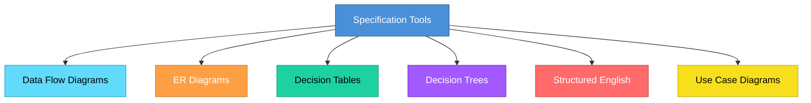
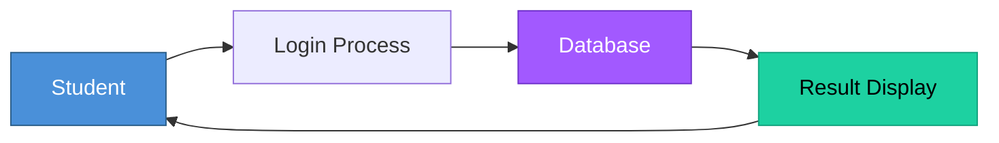
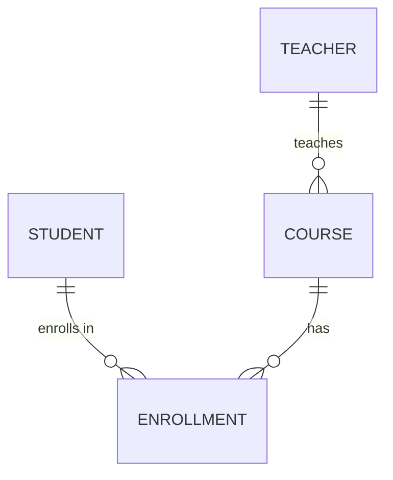
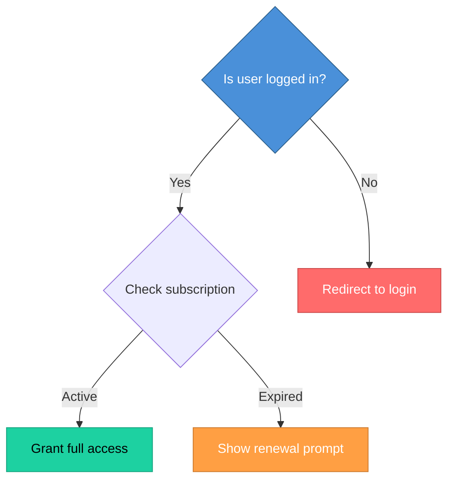

# Topic 15: Specification Tools

[< Prev: Formal Specification Methods](topic-14.md) | [Index](index.md) | [Next: Flow-Based Analysis (DFD) >](topic-16.md)

---

> After understanding formal specification methods, now we look at **practical tools** used to describe and model system requirements. Specification tools help represent system requirements clearly using **diagrams and structured representations** instead of only text.

---

## 1. What Are Specification Tools?

Specification tools are techniques or modeling tools used to describe:

- System functionality
- Data flow
- Data structure
- Object interactions
- System behavior

> They make requirements **visual** and **structured**.

---

## 2. Why Specification Tools Are Important

Plain text requirements can:

| Problem |
|---|
| Be misunderstood |
| Miss relationships |
| Hide logical gaps |

Diagrams make structure **visible**. They show:
- How data moves
- Which module depends on which
- What triggers what

> This clarity **prevents design mistakes**.

---

## 3. Major Specification Tools



---

## 4. Data Flow Diagram (DFD)

Shows how **data moves** through the system.

**Components:** Process, Data Store, External Entity, Data Flow

**Example (Online Exam System):**



> DFD focuses on **data movement**, not control logic.

---

## 5. Entity-Relationship (ER) Diagram

Shows how **data entities** relate to each other.



> Used to design **database structure**.

---

## 6. Decision Tables

Used when system behavior depends on **multiple conditions**.

**Example:**

| User is Admin | Payment Successful | Account Active | Action |
|---|---|---|---|
| Yes | Yes | Yes | **Grant Access** |
| Yes | Yes | No | Deny Access |
| No | Yes | Yes | Limited Access |
| No | No | Yes | Deny Access |

> Decision table organizes **all combinations** clearly.

---

## 7. Decision Trees

Graphical representation of **conditional logic**.



> Useful for modeling **business rules**.

---

## 8. Structured English

Uses controlled English language to specify logic clearly.

```
IF attendance < 75%
    THEN mark student as "Short Attendance"
    ELSE allow exam registration
```

> More structured than plain English.

---

## 9. Use Case Diagrams

Used in **Object-Oriented Analysis**. Shows:

- **Actors** (users)
- **Use cases** (system functions)

**Example:**

| Actor | Use Cases |
|---|---|
| Student | Login, View Results, Pay Fees |
| Teacher | Upload Marks, View Attendance |
| Admin | Manage Users, Generate Reports |

> Focuses on **user interaction**.

---

## 10. Real Industry Example

When building a large ERP:

| Tool | Purpose |
|---|---|
| DFD | Show data movement |
| ER Diagram | Database design |
| Use Case Diagram | User interaction |
| Decision Tables | Complex business logic |

> Each tool provides a **different projection** of the system.

---

## 11. Important Insight

Specification tools:

| Benefit |
|---|
| Reduce ambiguity |
| Improve communication |
| Detect missing logic |
| Support structured thinking |

> They **bridge the gap** between system analysis and system design.

---

[< Prev: Formal Specification Methods](topic-14.md) | [Index](index.md) | [Next: Flow-Based Analysis (DFD) >](topic-16.md)