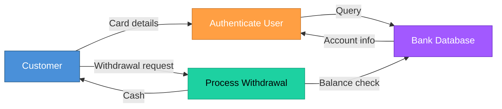
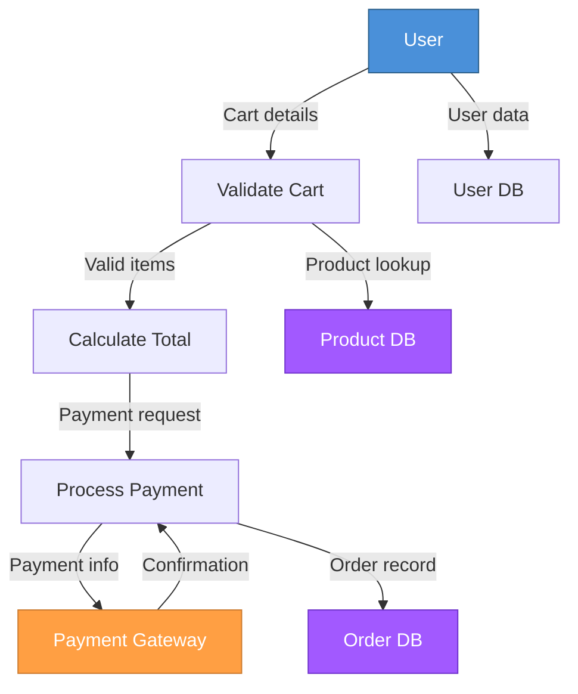
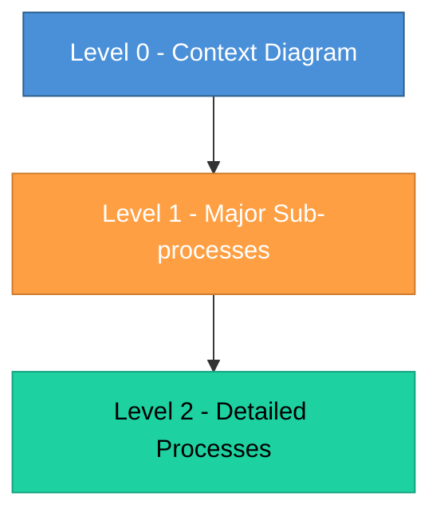

# Topic 16: Flow-Based Analysis (Data Flow Diagram -- DFD)

[< Prev: Specification Tools](topic-15.md) | [Index](index.md) | [Next: Data-Based Analysis (ER Modeling) >](topic-17.md)

---

> Now we move into one of the most important analysis techniques. Flow-based analysis focuses on **how data moves** through a system. The primary tool used here is the **Data Flow Diagram (DFD)**.

---

## 1. What is Flow-Based Analysis?

Flow-based analysis studies a system by analyzing:

- Where data **comes from**
- How it is **processed**
- Where it is **stored**
- Where it **goes**

> It does not focus on control logic or timing. It focuses purely on **data movement**.

---

## 2. What is a Data Flow Diagram (DFD)?

A DFD is a graphical representation of: **Input --> Process --> Output**

> It shows how data flows between components of a system.

---

## 3. Basic Components of DFD

| Component | Symbol | Description | Example |
|---|---|---|---|
| **External Entity** | Rectangle | Source or destination of data | Student, Admin, Bank |
| **Process** | Circle/Rounded rectangle | Transforms data | Validate Login, Process Payment |
| **Data Store** | Open-ended rectangle | Database or storage | Student Database |
| **Data Flow** | Arrow | Movement of data | Login credentials, Order details |

---

## 4. Simple Real-Life Example (Non-Technical)

### ATM System

> DFD focuses **only** on data movement.

---

## 5. Technical Example (CS Perspective)

### E-commerce Checkout System

> This visualizes system structure clearly.

---

## 6. Levels of DFD

DFDs are **hierarchical**.

| Level | Description | Example |
|---|---|---|
| **Level 0** (Context Diagram) | Entire system as one single process | User --> Online Exam System --> Result |
| **Level 1** | Breaks system into major sub-processes | Login, Attempt Exam, Evaluate, Generate Report |
| **Level 2** | Breaks sub-process into more detailed processes | Detailed login validation steps |

> This hierarchical breakdown **improves clarity**.

---

## 7. Why Flow-Based Analysis is Useful

| Benefit |
|---|
| Helps understand data processing |
| Identifies redundant data flow |
| Detects missing data storage |
| Helps in database design |
| Improves requirement clarity |

> Especially useful in systems where **data processing** is central.

---

## 8. Where It Is Most Useful

| Application Domain |
|---|
| Banking systems |
| Payroll systems |
| Inventory systems |
| College ERP |
| Billing systems |

> Any **data-heavy** application.

---

## 9. Limitations of DFD

| Limitation |
|---|
| Does not show control flow clearly |
| Does not show object relationships |
| Does not show timing behavior |
| Not ideal for event-driven systems |

> That is why **other analysis techniques** are also used.

---

## 10. Important Insight

> DFD answers: **"What happens to data inside the system?"**

It does **not** answer:
- **When** it happens
- **Why** it happens
- **How** modules are structured

> For that, other tools are required.

---

[< Prev: Specification Tools](topic-15.md) | [Index](index.md) | [Next: Data-Based Analysis (ER Modeling) >](topic-17.md)