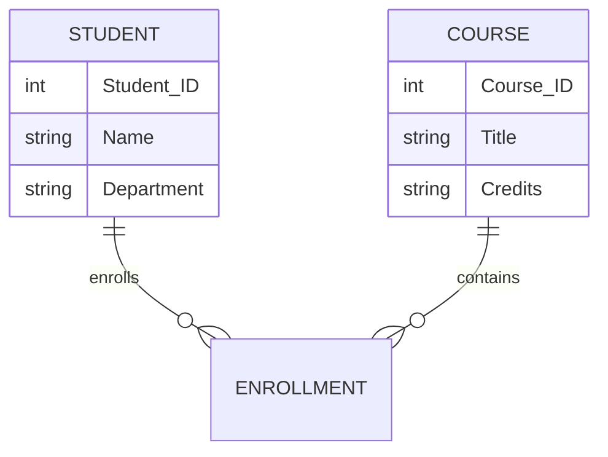
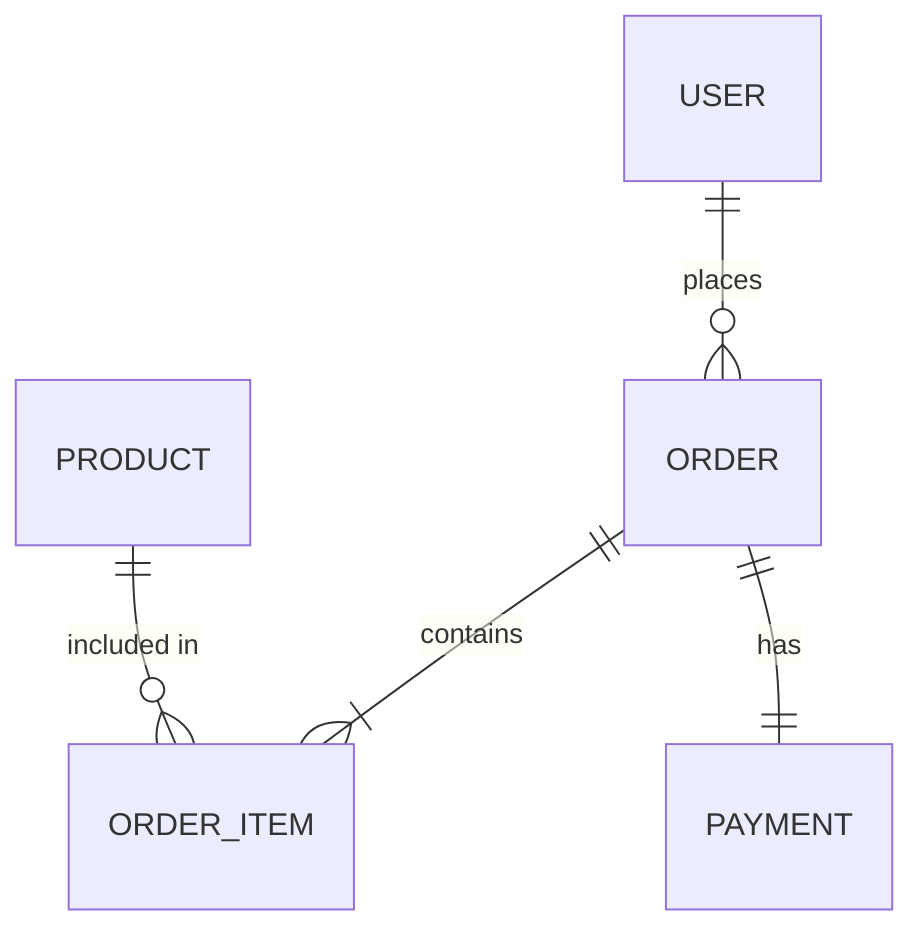

# Topic 17: Data-Based Analysis (Entity-Relationship Modeling)

[< Prev: Flow-Based Analysis (DFD)](topic-16.md) | [Index](index.md) | [Next: Object-Oriented Analysis >](topic-18.md)

---

> If Flow-Based Analysis focuses on **movement of data**, Data-Based Analysis focuses on **structure of data**. It answers: *What data does the system store? How are different data items related?*

> The primary tool used is the **Entity-Relationship (ER) Model**.

---

## 1. What is Data-Based Analysis?

Data-based analysis studies a system by identifying:

- **Entities** (things we store data about)
- **Attributes** (properties of those things)
- **Relationships** (how they connect)

> It is mainly used for **database design**.

---

## 2. What is an Entity?

An entity is a **real-world object or concept** about which data is stored.

| Non-Technical Examples | Technical Examples |
|---|---|
| Student | User |
| Teacher | Order |
| Book | Product |
| Account | Transaction |

> In database terms, entities become **tables**.

---

## 3. What is an Attribute?

Attributes are **properties** of an entity.

| Entity | Attributes |
|---|---|
| **Student** | Student_ID, Name, Age, Department |
| **Product** | Product_ID, Price, Stock, Category |

> Attributes become **table columns**.

---

## 4. What is a Relationship?

A relationship describes **how two entities are connected**.

| Domain | Relationship |
|---|---|
| College | Student **enrolls in** Course |
| E-commerce | Customer **places** Order |
| Banking | Account **belongs to** Customer |

> Relationships define how tables connect using **foreign keys**.

---

## 5. Types of Relationships

| Type | Description | Example |
|---|---|---|
| **One-to-One (1:1)** | One entity maps to exactly one other | One person has one passport |
| **One-to-Many (1:N)** | One entity maps to many | One teacher teaches many students |
| **Many-to-Many (M:N)** | Many map to many | Students enroll in multiple courses |

### Many-to-Many Resolution

Many-to-many requires a **junction table**:

```
Enrollment(Student_ID, Course_ID)
```



---

## 6. Simple Real-Life Example (Non-Technical)

### Library System

| Entity | Relationships |
|---|---|
| Member | Member **borrows** Book |
| Book | Book recorded in **Issue** record |
| Issue | Links Member and Book |

> This shows data structure clearly.

---

## 7. Technical Example (CS Perspective)

### Online Shopping System



From this ER model, **database schema** can be derived.

---

## 8. Why ER Modeling is Important

| Without ER Modeling | With ER Modeling |
|---|---|
| Data duplication occurs | Clear structure |
| Relationships become unclear | Proper normalization |
| Queries become inefficient | Scalable database design |
| Database becomes inconsistent | Better performance |

---

## 9. Difference Between DFD and ER Model

| Aspect | DFD | ER Model |
|---|---|---|
| **Focus** | Flow of data | Structure of data |
| **Shows** | How data moves | How data is stored |
| **Used for** | Process analysis | Database design |

**Example:**
- DFD shows how **order data moves**
- ER model shows how **order is stored**

> Both are **complementary**.

---

## 10. Important Insight

> Many system failures are **not due to bad code**, but due to **poor database design**.

> Good ER modeling early in system analysis **prevents future data issues**.

---

[< Prev: Flow-Based Analysis (DFD)](topic-16.md) | [Index](index.md) | [Next: Object-Oriented Analysis >](topic-18.md)