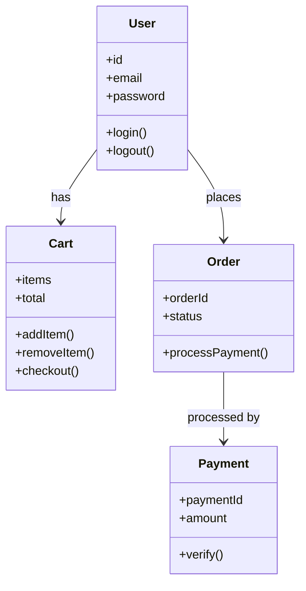
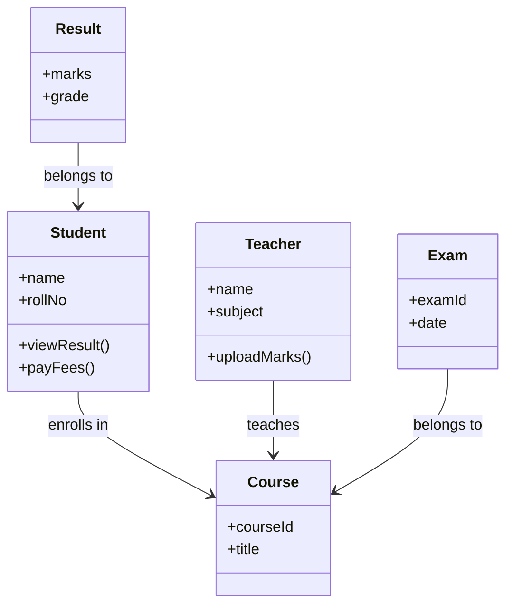

# Topic 18: Object-Oriented Analysis (OOA)

[< Prev: Data-Based Analysis (ER Modeling)](topic-17.md) | [Index](index.md) | [Next: Principles of System Documentation >](topic-19.md)

---

> So far: Flow-based analysis looked at **data movement**. Data-based analysis looked at **data structure**. Now we move to Object-Oriented Analysis, which models the system using **objects** -- similar to how modern software is actually built.

---

## 1. What is Object-Oriented Analysis?

Object-Oriented Analysis is the process of analyzing a system by identifying:

- **Objects** -- real-world entities
- **Classes** -- blueprints for objects
- **Attributes** -- data/properties
- **Methods** -- behavior/functions
- **Relationships** -- between objects

> Instead of thinking in terms of processes or data only, we think in terms of **real-world objects and their behavior**.

---

## 2. What is an Object?

An object represents a real-world entity with:

| Aspect | Description | Example (Student) |
|---|---|---|
| **State** (data) | Properties | Name, Roll number, Attendance % |
| **Behavior** (functions) | Actions | Register for course, View result, Pay fees |

> This maps directly to **object-oriented programming**.

---

## 3. Simple Real-Life Example (Non-Technical)

### A Car

| State | Behavior |
|---|---|
| Color | Start |
| Speed | Stop |
| Fuel level | Accelerate |

> In object-oriented thinking, the system is composed of **interacting objects** like this.

---

## 4. Technical Example (CS Perspective)

### E-commerce System

Instead of thinking: *"Process payment data"*
We think: *"Order object processes payment through Payment object."*

---

## 5. Key Concepts in Object-Oriented Analysis

| Concept | Description | Example |
|---|---|---|
| **Class** | Blueprint of objects | `class Student` |
| **Object** | Instance of class | Student named "Rahul" |
| **Encapsulation** | Data and behavior grouped together | User class with login method |
| **Inheritance** | Child class inherits from parent | `Admin extends User` |
| **Association** | Objects related to each other | Order associated with User |

---

## 6. Tools Used in OOA

All part of **UML (Unified Modeling Language)**:

| Tool | Purpose |
|---|---|
| **Use Case Diagrams** | Show user interactions |
| **Class Diagrams** | Show object structure |
| **Sequence Diagrams** | Show interaction order |
| **Activity Diagrams** | Show workflow |

---

## 7. Example: College ERP (OOA Perspective)

> This object-based thinking aligns directly with **real-world entities**.

---

## 8. Why Object-Oriented Analysis is Powerful

| Advantage |
|---|
| Matches real-world thinking |
| Aligns with modern programming languages (Java, Python, C++) |
| Encourages modular design |
| Supports reuse |
| Improves maintainability |

---

## 9. Comparison with Other Analysis Methods

| Method | Focus |
|---|---|
| **DFD** | Data flow |
| **ER Model** | Data relationships |
| **OOA** | Objects + behavior + interaction |

> Modern systems prefer OOA because it **matches implementation patterns**.

---

## 10. Important Insight

> If you design using OOA properly, your transition from **analysis --> design --> coding** becomes smooth.

> Because: Classes identified in analysis often become **actual classes in code**.

---

[< Prev: Data-Based Analysis (ER Modeling)](topic-17.md) | [Index](index.md) | [Next: Principles of System Documentation >](topic-19.md)