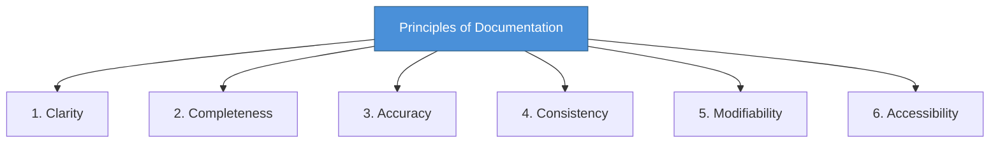

# Topic 19: Principles of System Documentation

[< Prev: Object-Oriented Analysis](topic-18.md) | [Index](index.md) | [Next: Types of Documentation >](topic-20.md)

---

> After analysis and specification, everything must be **documented properly**. Documentation is not optional in software engineering. It ensures clarity, maintainability, and long-term usability.

---

## 1. What is System Documentation?

System documentation is written material that explains:

| Topic | Description |
|---|---|
| System architecture | How the system is structured |
| Design decisions | Why certain choices were made |
| Data structures | How data is organized |
| Algorithms | How processing works |
| Installation steps | How to set up the system |
| Configuration details | How to configure the system |

> It is mainly for **developers, administrators, and maintainers**.

---

## 2. Why Documentation Is Important

Imagine a software developer builds a system and leaves the company.

| Without Documentation | With Documentation |
|---|---|
| New developers struggle | Quick onboarding |
| Bugs take longer to fix | Faster debugging |
| Changes become risky | Confident modifications |
| System knowledge is lost | Knowledge preserved |

> Documentation **preserves knowledge**.

---

## 3. Simple Real-Life Example (Non-Technical)

A company installs a large industrial machine. It comes with:
- User manual
- Maintenance guide
- Safety instructions

> Without manuals, machine maintenance becomes dangerous and inefficient. **Software is similar.**

---

## 4. Technical Example

Suppose you build a backend API for a college ERP. If you document:

| What to Document | Benefit |
|---|---|
| API endpoints | Other teams can integrate |
| Database schema | Data layer is understood |
| Deployment process | Reliable deployments |
| Environment variables | Correct configuration |
| Authentication logic | Security is clear |

> Without documentation, future developers must **reverse-engineer** your code.

---

## 5. Principles of Good System Documentation

### 1. Clarity

Avoid vague explanations.

| Bad | Good |
|---|---|
| "System stores data efficiently" | "Student records stored in PostgreSQL using normalized schema" |

### 2. Completeness

Document all modules, interfaces, constraints, dependencies. Partial documentation is almost as bad as none.

### 3. Accuracy

Documentation must match actual implementation. **Outdated documentation is dangerous.**

### 4. Consistency

Use consistent terminology. If you call something "User" in one section, do not call it "Client" in another.

### 5. Modifiability

Documentation should be easy to update. Modern practice:
- Markdown files
- Wiki pages
- Version-controlled documentation

### 6. Accessibility

Documentation should be easy to find and access.

| Format | Example |
|---|---|
| API docs | Swagger |
| Project docs | README in repository |
| Team docs | Internal wiki |

---

## 6. Types of System Documentation (Overview)

| Type | Audience |
|---|---|
| Technical documentation | Developers |
| User documentation | End users |
| Operational documentation | System administrators |

> Each serves a **different audience**. (Detailed in next topic.)

---

## 7. Real Industry Insight

Large systems may run for **10-20 years**. Developers change. Technology evolves.

> Only documentation ensures **continuity**.

> Many companies fail to maintain legacy systems because documentation was ignored.

---

## 8. Important Insight

Good documentation:

| Benefit |
|---|
| Reduces onboarding time |
| Reduces bug resolution time |
| Reduces maintenance cost |
| Improves scalability |

> In real engineering practice, undocumented systems are considered **technical debt**.

---

[< Prev: Object-Oriented Analysis](topic-18.md) | [Index](index.md) | [Next: Types of Documentation >](topic-20.md)