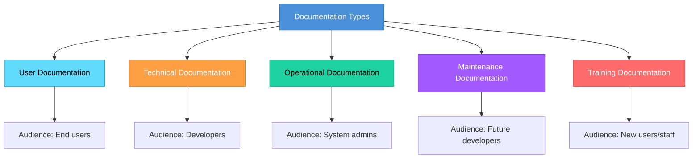

# Topic 20: Types of Documentation

[< Prev: Principles of System Documentation](topic-19.md) | [Index](index.md) | [Next: Importance of Documentation >](topic-21.md)

---

> In software engineering, documentation is written for **different audiences**. Not everyone interacting with a system needs the same level of technical detail. Therefore, documentation is categorized into different types.

---

## 1. User Documentation

Written for the **end users** of the software. Explains how to use the system without needing technical knowledge.

| Contents |
|---|
| Installation instructions |
| User interface guide |
| Feature explanation |
| Step-by-step usage instructions |
| Troubleshooting tips |

### Example: College ERP

| User | Documentation Content |
|---|---|
| Students | How to log in, View results, Pay fees |
| Teachers | How to mark attendance, Upload marks |

> This documentation **avoids technical terms**.

---

## 2. Technical Documentation

Meant for **developers and system engineers**. Explains how the software system is built internally.

| Contents |
|---|
| System architecture |
| Module descriptions |
| Database schema |
| API documentation |
| Algorithms used |
| Source code structure |

### Example: E-commerce Platform API

```
Endpoint: POST /api/orders

Request:
  - user_id
  - product_id
  - quantity

Response:
  - order_id
  - status
  - timestamp
```

> This allows other developers to **integrate** with the system.

---

## 3. Operational Documentation

Used by **system administrators and IT staff** who manage the system in production.

| Contents |
|---|
| Deployment instructions |
| Server configuration |
| Backup procedures |
| System monitoring |
| Disaster recovery procedures |

### Example: Cloud Web Application

| Task | Documented Procedure |
|---|---|
| Deploy updates | CI/CD pipeline steps |
| Restart services | Service restart commands |
| Restore database | Backup restoration steps |
| Monitor logs | Log aggregation setup |

---

## 4. Maintenance Documentation

Helps developers **modify or update** the system later.

| Contents |
|---|
| Known issues |
| System limitations |
| Change history |
| Version updates |
| Bug fixes |

> A developer reading this may learn why a particular design decision was taken, and which modules should not be modified without caution.

---

## 5. Training Documentation

Used to **train new users or staff**.

| Format |
|---|
| Tutorials |
| Video guides |
| Training manuals |
| Practice exercises |

> When a new employee joins, training documentation helps them learn the software system quickly.

---

## 6. Summary of Documentation Types



| Type | Focus | Purpose |
|---|---|---|
| **User** | End users | How to use system |
| **Technical** | Developers | How system is built |
| **Operational** | System administrators | How system runs |
| **Maintenance** | Future developers | How to update system |
| **Training** | New users/staff | Learning system usage |

---

## 7. Real Industry Insight

In professional software systems:

| Role | Relies On |
|---|---|
| Developers | Technical documentation |
| Users | User documentation |
| DevOps teams | Operational documentation |

> If **any type** is missing, the system becomes harder to use or maintain.

> Many open-source projects fail because they lack good documentation.

---

[< Prev: Principles of System Documentation](topic-19.md) | [Index](index.md) | [Next: Importance of Documentation >](topic-21.md)