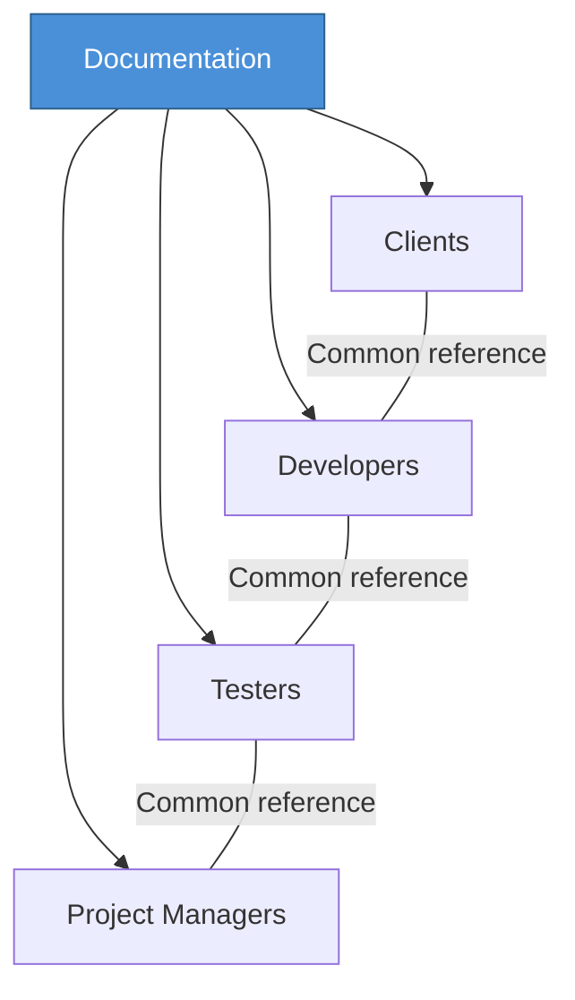

# Topic 21: Importance of Documentation

[< Prev: Types of Documentation](topic-20.md) | [Index](index.md) | [Next: Data and Fact Gathering Techniques >](topic-22.md)

---

> Documentation is one of the most **underestimated** parts of software engineering. Many beginners focus only on writing code, but in real systems documentation is critical for the software's long-term success.

---

## 1. Improves Understanding of the System

Software systems often contain thousands or millions of lines of code. Without documentation, understanding how the system works becomes extremely difficult.

| With Documentation | Without Documentation |
|---|---|
| Quickly understand how system works | Read large amounts of code |
| See how modules interact | Guess at relationships |
| Know where to make changes | Risk breaking other parts |

---

## 2. Helps in System Maintenance

Most software costs occur **after** the system is deployed. Developers need to fix bugs, add features, and improve performance.

**Example:** If an error occurs in a payment module:

| Documented System | Undocumented System |
|---|---|
| Knows which APIs are used | Must trace through code |
| Knows which database tables involved | Must reverse-engineer |
| Locates issue quickly | Takes much longer |

---

## 3. Supports Knowledge Transfer

Developers frequently change jobs or teams. If knowledge exists only in one person's mind, the organization becomes **dependent on that individual**.

> Documentation ensures that knowledge is **shared**.

**Example:** A company loses a senior developer who designed the entire system. If documented properly, new developers can continue without major problems.

---

## 4. Assists in Training New Employees

| With Training Documentation | Without Training Documentation |
|---|---|
| Quick onboarding | Slow learning curve |
| Understand system workflow | Shadow senior employees |
| Clear operating procedures | Learn by trial and error |

---

## 5. Helps in System Testing

Testing teams rely heavily on documentation. Test cases are often created based on system requirements described in documentation.

**Example:** If documentation states *"The system must reject passwords shorter than 8 characters"* -- testing team can design test cases to verify this requirement.

---

## 6. Improves Communication Between Stakeholders

Software projects involve many stakeholders:

> Documentation acts as a **common reference**. It ensures everyone understands the system in the same way.

---

## 7. Supports Future System Enhancements

Software systems evolve over time. New features are added and old ones improved.

**Example:** A company wants to add a mobile application to an existing system. Documentation of backend APIs helps mobile developers **integrate their application easily**.

---

## 8. Helps in Compliance and Legal Requirements

Some industries require documentation for legal or regulatory reasons:

| Industry | Requirement |
|---|---|
| Banking systems | Financial compliance |
| Healthcare systems | Patient data privacy |
| Aviation systems | Safety certification |

> Proper documentation proves that systems follow required standards.

---

## 9. Reduces Development Risk

Without documentation, small misunderstandings can lead to large errors.

Documentation reduces:
- Miscommunication
- Incorrect implementation
- Project delays

---

## 10. Important Insight

> A **well-documented system** can survive even if its original developers leave.

> An **undocumented system** becomes extremely difficult to maintain or expand.

> This is why professional software projects always include documentation as a **core activity**.

---

[< Prev: Types of Documentation](topic-20.md) | [Index](index.md) | [Next: Data and Fact Gathering Techniques >](topic-22.md)