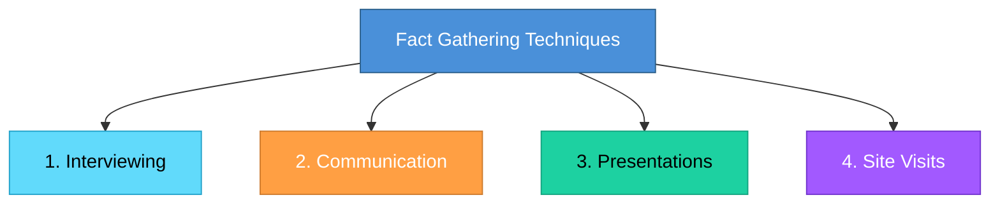

# Topic 22: Data and Fact Gathering Techniques

[< Prev: Importance of Documentation](topic-21.md) | [Index](index.md) | [Next: Feasibility Study >](topic-23.md)

---

> Before designing or building software, analysts must understand the real problem and the current system. **Data and fact gathering techniques** are methods used by system analysts to collect accurate information about system requirements.

---

## 1. Overview of Techniques

---

## 2. Interviewing

The system analyst **directly talks** to people who use or manage the system to understand their requirements, problems, and expectations.

### Example (Non-Technical): Library Management System

| Interviewee | Sample Questions |
|---|---|
| Librarian | How are books currently issued? |
| Students | How do you track late returns? |
| Library staff | What problems occur frequently? |

### Example (Software): Hospital Management System

Interviews with doctors, reception staff, and billing department help identify features such as:
- Appointment scheduling
- Patient record management
- Billing automation

---

## 3. Communication

All interactions between the system analyst and stakeholders during requirement gathering.

| Channel | Purpose |
|---|---|
| Emails | Formal question-answer |
| Meetings | Group discussion |
| Workshops | Collaborative requirement definition |
| Discussions | Quick clarifications |

### Example: Online Examination System

Communication with university administrators may clarify:
- Should exams auto-submit when time ends?
- Can students reattempt questions?
- How should results be displayed?

> Clear communication ensures developers build the **correct system**.

---

## 4. Presentations

Analysts prepare presentations to explain system ideas or proposals to stakeholders.

| Purpose |
|---|
| Demonstrate system concepts |
| Explain project plans |
| Show prototypes or designs |
| Collect feedback from users |

### Example: Inventory Management System

The analyst presents:
- How the new system will track inventory
- How reports will be generated
- How employees will use the system

> After the presentation, stakeholders can **suggest improvements**.

---

## 5. Site Visits

Physically visiting the location where the system will be used. This helps analysts **observe how work is actually performed**.

> Sometimes users forget to mention certain problems during interviews, but **observing real operations reveals hidden issues**.

### Example (Non-Technical): Restaurant Software

| Observation | Insight Gained |
|---|---|
| How orders are taken | Order flow design |
| How kitchen receives orders | Kitchen display system |
| How billing is done | Payment integration needs |

### Example (Software): Warehouse Management System

A site visit might reveal:
- How inventory is stored physically
- How workers scan items
- How shipments are processed

> This information helps design **better system workflows**.

---

## 6. Why Fact Gathering Is Important

> If developers design software without understanding the real environment, the system **may fail**.

**Example:** If a system requires constant internet but the organization has poor connectivity, the system becomes unusable.

> Fact gathering ensures the system **matches real-world conditions**.

---

## 7. Important Insight

> Many software failures occur because developers build **what they think** users want instead of **what users actually need**.

> Fact gathering techniques ensure requirements are based on **real observations and real user needs**.

---

[< Prev: Importance of Documentation](topic-21.md) | [Index](index.md) | [Next: Feasibility Study >](topic-23.md)