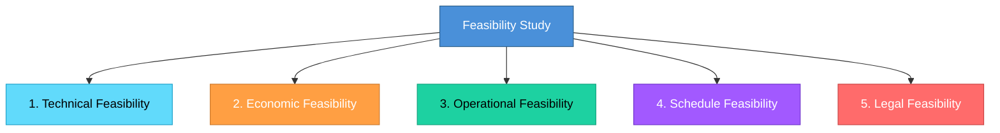

# Topic 23: Feasibility Study

[< Prev: Data and Fact Gathering Techniques](topic-22.md) | [Index](index.md) | [Next: Feasibility Report >](topic-24.md)

---

> Before building a system, organizations must determine whether the project is **practical and worth pursuing**. This evaluation process is called a feasibility study.

> In simple terms, it answers the question: **"Should we build this system?"**

---

## 1. What is Feasibility Study?

A feasibility study is an investigation conducted during system planning to evaluate whether a proposed software project is **viable**.

It helps determine:
- Can the system be built with available technology?
- Is it financially beneficial?
- Will the organization actually use it?

> If a project is not feasible, it should be **rejected before development begins**.

---

## 2. Why Feasibility Study Is Important

Software development requires time, money, skilled developers, and infrastructure.

> Without feasibility analysis, companies may invest heavily in projects that **cannot succeed**.

> A feasibility study **reduces risk** before development starts.

---

## 3. Types of Feasibility

### 1. Technical Feasibility

Determines whether required technology, tools, and expertise exist.

| Question | Example |
|---|---|
| Do we have required hardware/software? | ML infrastructure for AI grading |
| Do developers have required skills? | Machine learning expertise |
| Can system handle expected workload? | 10,000 concurrent users |

### 2. Economic Feasibility

Evaluates whether the project is **financially worthwhile**.

| Costs | Benefits |
|---|---|
| Software development | Reduced manual errors |
| Server infrastructure | Faster inventory tracking |
| Employee training | Reduced labor cost |

> If benefits **outweigh** costs, the project is economically feasible.

### 3. Operational Feasibility

Evaluates whether the system will actually **work within the organization** and be accepted by users.

| Question |
|---|
| Will employees use the system? |
| Does the system fit current workflow? |
| Will training be required? |

> Even if technically perfect, a system fails operational feasibility if users **resist** using it.

### 4. Schedule Feasibility

Determines whether the project can be completed within the **required timeframe**.

> Example: If a university needs an online exam system within two months but development requires six months, the schedule is not feasible.

### 5. Legal Feasibility

Ensures the system complies with **laws and regulations**.

| Area | Example |
|---|---|
| Data protection | GDPR compliance |
| Software licensing | Open-source license compliance |
| Financial compliance | Banking regulations |
| Healthcare | Patient data privacy |

---

## 4. Real Software Example

### Ride-Sharing Application (like Uber)

| Feasibility Type | Question |
|---|---|
| Technical | Can we handle real-time GPS tracking? |
| Economic | Can we afford cloud infrastructure and development? |
| Operational | Will drivers adopt the system? |
| Legal | Are ride-sharing services allowed in the region? |

> If any major feasibility factor **fails**, the project may be abandoned or redesigned.

---

## 5. Important Insight

> Feasibility studies help organizations **avoid costly mistakes**.

> Many failed software projects occur because feasibility was **not properly evaluated** before development began.

---

[< Prev: Data and Fact Gathering Techniques](topic-22.md) | [Index](index.md) | [Next: Feasibility Report >](topic-24.md)