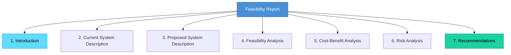

# Topic 24: Feasibility Report

[< Prev: Feasibility Study](topic-23.md) | [Index](index.md) | [Next: Prototyping >](topic-25.md)

---

> After performing a feasibility study, the findings must be **formally documented**. That document is called a feasibility report. It helps decision-makers determine whether a project should **proceed, be modified, or be cancelled**.

---

## 1. What is a Feasibility Report?

A feasibility report presents the results of a feasibility study and provides **recommendations** about the proposed system.

It includes analysis of: Technical, Economic, Operational, Schedule, and Legal feasibility.

> The report is submitted to **management or stakeholders** for approval.

---

## 2. Purpose of a Feasibility Report

| Objective |
|---|
| Provide clear understanding of the proposed system |
| Evaluate risks and limitations |
| Estimate costs and benefits |
| Recommend the best course of action |

> It helps management decide whether to **invest resources** in the project.

---

## 3. Structure of a Feasibility Report

### 1. Introduction

| Contents |
|---|
| Purpose of the report |
| Description of the problem |
| Overview of the proposed system |

### 2. Description of the Current System

**Example:** A retail shop tracks inventory using paper records or spreadsheets.

| Problems |
|---|
| Data entry errors |
| Slow inventory updates |
| Difficulty generating reports |

### 3. Description of the Proposed System

**Example:** The proposed system may include:
- Automated inventory tracking
- Barcode scanning
- Real-time stock updates
- Automatic reorder alerts

### 4. Feasibility Analysis

| Type | Key Question |
|---|---|
| Technical | Can the system be built using existing technology? |
| Economic | Will the benefits justify the costs? |
| Operational | Will users adopt the system? |
| Schedule | Can the project be completed in time? |

### 5. Cost-Benefit Analysis

| Costs | Benefits |
|---|---|
| Development expenses | Increased efficiency |
| Hardware and software costs | Reduced errors |
| Maintenance costs | Improved productivity |

### 6. Risk Analysis

| Potential Risk |
|---|
| Technology limitations |
| Budget overruns |
| Resistance from users |
| Security concerns |

### 7. Recommendations

| Possible Outcome |
|---|
| Proceed with the project |
| Modify the proposed system |
| Delay development |
| Reject the project |

---

## 4. Real-Life Example

### Hospital Electronic Patient Record System

| Feasibility Type | Finding |
|---|---|
| Technical | Hospital infrastructure supports the system |
| Economic | Long-term savings outweigh initial costs |
| Operational | Staff training required but system improves efficiency |

> **Recommendation:** Proceed with development.

---

## 5. Importance of Feasibility Reports

> A feasibility report provides a **clear and structured basis** for decision-making.

> Without such a report, organizations may invest in projects without fully understanding the **risks, costs, or limitations**.

> It ensures that major decisions are supported by **systematic analysis**.

---

[< Prev: Feasibility Study](topic-23.md) | [Index](index.md) | [Next: Prototyping >](topic-25.md)