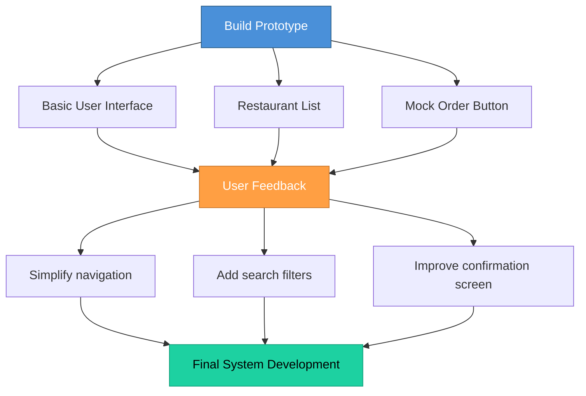

# Topic 25: Prototyping

[< Prev: Feasibility Report](topic-24.md) | [Index](index.md) | [Next: Cost-Benefit Analysis >](topic-26.md)

---

> In many software projects, users cannot clearly explain their requirements at the beginning. To solve this problem, developers create an **early working model** of the system called a **prototype**.

---

## 1. What is Prototyping?

Prototyping is the process of building an early, simplified version of a software system to **demonstrate features, gather feedback, and refine requirements**.

> This model is not the final system. It is mainly used to **understand user needs** and improve system design.

---

## 2. Why Prototyping is Needed

Users often say vague things like:
- "I want an easy interface"
- "I want quick reports"

When users **see a prototype**, they can better explain:
- What they **like**
- What they **dislike**
- What needs to **change**

> This helps developers understand requirements more clearly.

---

## 3. Simple Real-Life Example (Non-Technical)

A person wants a custom suit. Instead of stitching the final suit immediately, the tailor first makes a **rough trial version**.

The customer tries it and suggests changes:
- Tighten shoulders
- Adjust sleeve length
- Change collar style

> The trial suit is similar to a software **prototype**.

---

## 4. Technical Example (Software Development)

### Food Delivery App

---

## 5. Types of Prototyping

| Type | Description | What Happens After? |
|---|---|---|
| **Throwaway Prototype** | Created only to understand requirements | Discarded; real system built from scratch |
| **Evolutionary Prototype** | Gradually evolves into the final system | Continuously improved with features |

### Throwaway Example
A rough UI mockup built quickly to show users.

### Evolutionary Example
A startup builds an initial web app prototype and gradually transforms it into the full product.

---

## 6. Advantages of Prototyping

| Advantage |
|---|
| Helps clarify user requirements |
| Improves communication between users and developers |
| Detects design problems early |
| Reduces development risk |
| Increases user involvement in development |

---

## 7. Disadvantages of Prototyping

| Disadvantage |
|---|
| Users may think the prototype is the final system |
| Poor system architecture if prototype code is reused |
| Continuous changes may delay development |

> Prototypes must be **managed carefully**.

---

## 8. Real Software Example

Many modern products begin with prototypes.

**Example:** A startup may create a clickable interface prototype using tools like **Figma** or **Adobe XD** before writing actual code.

> Users interact with the design and provide feedback **before development begins**.

---

## 9. Important Insight

> Prototyping is especially useful when **requirements are unclear** or when **user interaction** plays a major role in the system.

> It reduces misunderstandings between users and developers.

---

[< Prev: Feasibility Report](topic-24.md) | [Index](index.md) | [Next: Cost-Benefit Analysis >](topic-26.md)