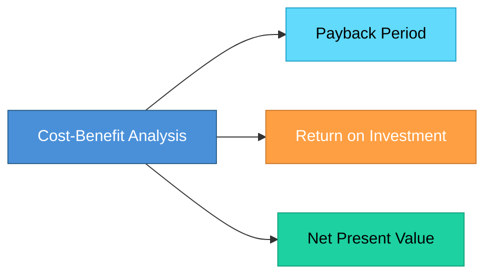

# Topic 26: Cost-Benefit Analysis (Tools and Techniques)

[< Prev: Prototyping](topic-25.md) | [Index](index.md) | [Next: Idealized Design and Constrained Design >](topic-27.md)

---

> Before developing a software system, organizations must evaluate whether the expected benefits justify the costs. **Cost-benefit analysis** compares the total cost of building and maintaining a system with the benefits it will provide.

---

## 1. What is Cost-Benefit Analysis?

A method used to determine whether a proposed system is **financially worthwhile**.

> If the benefits are greater than the costs, the project is considered **economically viable**.

---

## 2. Types of Costs in Software Projects

| Cost Type | Description | Example |
|---|---|---|
| **Development Cost** | Building the system | Developer salaries, tools, cloud services |
| **Operational Cost** | Running and maintaining after deployment | Server maintenance, updates, support |
| **Training Cost** | Teaching employees the new system | Hospital staff learning digital records |

---

## 3. Types of Benefits

### Tangible Benefits (Measurable in money)

| Example |
|---|
| Reduced labor cost |
| Increased productivity |
| Faster transactions |
| Reduced operational expenses |

### Intangible Benefits (Hard to measure directly)

| Example |
|---|
| Improved customer satisfaction |
| Better decision making |
| Increased employee morale |
| Improved data accuracy |

---

## 4. Tools and Techniques for Cost-Benefit Analysis

### Payback Period

Calculates how long it takes for the system to **recover the initial investment**.

```
Payback Period = Total Cost / Annual Savings
```

**Example:** Cost = $100,000, Annual savings = $25,000

> Payback Period = **4 years**

### Return on Investment (ROI)

Measures how much **profit** the system generates compared to its cost.

```
ROI = (Net Benefit / Total Cost) x 100
```

**Example:** Cost = $50,000, Benefits = $80,000

> Net Benefit = $30,000. ROI = **(30,000 / 50,000) x 100 = 60%**

### Net Present Value (NPV)

Money received in the future is worth **less** than money today due to inflation.

> NPV adjusts future benefits to present value. If NPV is **positive**, the project is financially beneficial.



---

## 5. Example of Cost-Benefit Analysis

### Automated Inventory Management System

| Costs | Amount |
|---|---|
| Development | $40,000 |
| Hardware and servers | $10,000 |
| Training | $5,000 |
| **Total** | **$55,000** |

| Benefits | Estimated Annual Savings |
|---|---|
| Reduced inventory errors | Included |
| Reduced labor costs | Included |
| Faster stock management | Included |
| **Total** | **$20,000/year** |

> Payback period = $55,000 / $20,000 = **2.75 years**

---

## 6. Importance of Cost-Benefit Analysis

| Purpose |
|---|
| Avoid unnecessary spending |
| Select the most beneficial projects |
| Allocate resources efficiently |
| Justify project investments |

---

## 7. Key Insight

> Many technically impressive software systems fail because they are **not economically viable**.

> Cost-benefit analysis ensures that software projects provide **real value** to the organization.

---

[< Prev: Prototyping](topic-25.md) | [Index](index.md) | [Next: Idealized Design and Constrained Design >](topic-27.md)