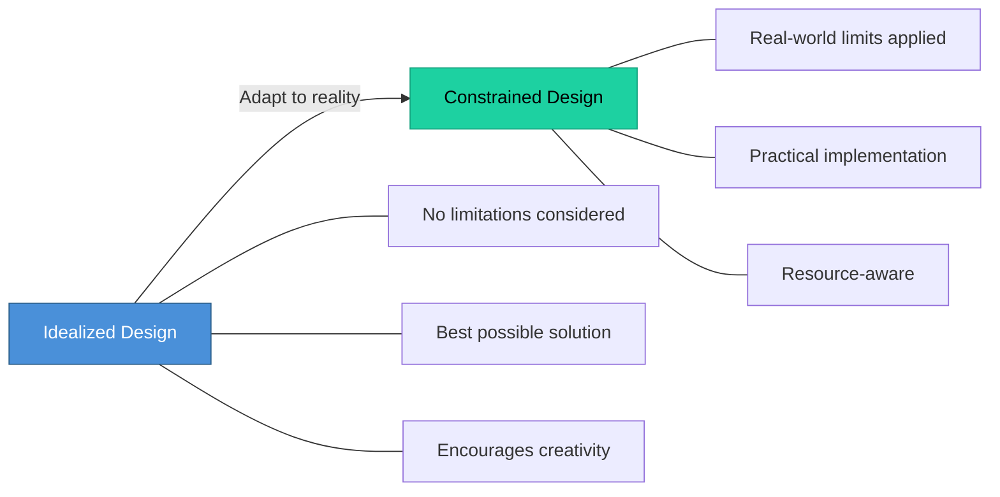

# Topic 27: Idealized Design and Constrained Design

[< Prev: Cost-Benefit Analysis](topic-26.md) | [Index](index.md) | [Next: Process-Oriented Design >](topic-28.md)

---

> After system planning and requirement analysis, the next step is **system design**. Two important design approaches are **idealized design** and **constrained design**.

---

## 1. Idealized Design

Designing the system **without considering real-world limitations**. The goal is to imagine the **best possible system**.

Designers ignore constraints such as budget, time, or technology limitations. The focus is on creating the **most effective solution**.

### Example (Non-Technical): Perfect Transportation System

| Feature |
|---|
| High-speed trains everywhere |
| No traffic congestion |
| Instant ticket booking |
| Fully automated vehicles |

> However, such a system may not be possible due to cost or infrastructure limitations.

### Software Example: Global Video Streaming Platform

| Idealized Feature |
|---|
| Unlimited server capacity |
| Zero latency streaming worldwide |
| Perfect recommendation system |
| Real-time video quality adjustment |

---

## 2. Constrained Design

Considers **real-world limitations** such as:

- Budget
- Time constraints
- Hardware limitations
- Existing infrastructure
- Technical expertise

> The final system must be built **within these constraints**.

### Example (Non-Technical): City Transportation

Instead of high-speed trains everywhere, the city implements:
- Improved bus routes
- Limited metro lines
- Traffic management systems

### Software Example: Startup Video Streaming

| Idealized | Constrained |
|---|---|
| Global distributed servers | Cloud hosting on limited servers |
| AI-based recommendation | Basic recommendation algorithm |
| Ultra-high-quality streaming | Standard video quality |

> The system **evolves gradually** as resources increase.

---

## 3. Comparison

| Aspect | Idealized Design | Constrained Design |
|---|---|---|
| **Focus** | Perfect solution | Realistic solution |
| **Limitations** | Ignored | Considered |
| **Purpose** | Vision and creativity | Practical implementation |
| **When used** | Early planning | Actual development |

---

## 4. Importance in Software Engineering

> Successful software systems usually **begin with an ideal concept** and then **refine it based on constraints**.

- Idealized design encourages **creativity and long-term vision**
- Constrained design ensures the system can be **built within available resources**

---

[< Prev: Cost-Benefit Analysis](topic-26.md) | [Index](index.md) | [Next: Process-Oriented Design >](topic-28.md)