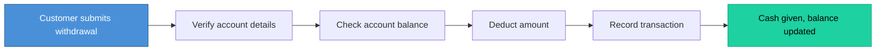
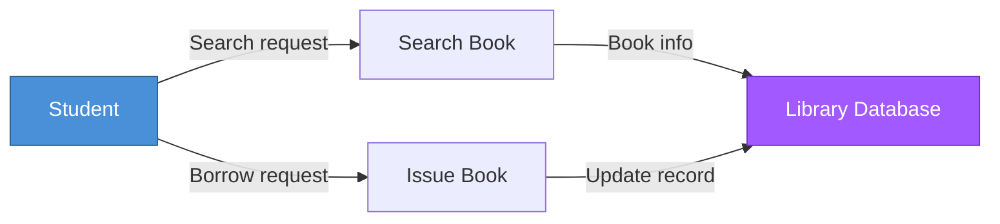

# Topic 28: Process-Oriented Design (Gane-Sarson and Yourdon)

[< Prev: Idealized Design and Constrained Design](topic-27.md) | [Index](index.md) | [Next: Data-Oriented Design >](topic-29.md)

---

> After analyzing the system, the next step is designing how the system will **process data**. In process-oriented design, the focus is on **processes (functions)** that transform inputs into outputs.

---

## 1. What is Process-Oriented Design?

Process-oriented design organizes the system around **processes or procedures**.

- A process receives **input data**, performs operations, and produces **output data**
- The entire system is viewed as a collection of **interconnected processes**
- This approach was widely used **before object-oriented programming** became popular

---

## 2. Simple Real-Life Example (Non-Technical)

### Bank Transaction Process

> The focus is on the **sequence of operations**.

---

## 3. Software Example: Online Exam System

| Step | Process |
|---|---|
| Input | Student answers exam questions |
| Process 1 | Validate student login |
| Process 2 | Load exam questions |
| Process 3 | Record answers |
| Process 4 | Evaluate answers |
| Process 5 | Generate results |
| Output | Student receives exam score |

---

## 4. Tools Used in Process-Oriented Design

Two popular **DFD notation** styles:

| Notation | Description |
|---|---|
| **Gane-Sarson** | Structured diagramming with detailed labeling |
| **Yourdon** | Simpler and easier to read |

---

## 5. Gane-Sarson Notation

Uses specific shapes for different elements:

| Element | Description | Example |
|---|---|---|
| **Process** | Function or operation | Place Order |
| **Data Store** | Stored data (database) | Product Database |
| **External Entity** | Source/destination of data | Customer |
| **Data Flow** | Arrows showing data movement | Order information |

---

## 6. Yourdon Notation

Uses slightly different symbols but represents the **same concepts**. Generally **simpler** and easier to read.

### Example: Library System

---

## 7. Where Process-Oriented Design Is Useful

| Application |
|---|
| Payroll systems |
| Billing systems |
| Banking transaction systems |
| Inventory management systems |

> Systems heavily focused on **data processing**.

---

## 8. Limitations

| Limitation |
|---|
| Focuses heavily on processes rather than data structures |
| Does not represent real-world entities well |
| Modern development prefers object-oriented design |

---

## 9. Important Insight

> Process-oriented design helps engineers understand how data is processed **step by step**. It was the dominant method in earlier structured programming and still provides useful insights for **data-processing systems**.

---

[< Prev: Idealized Design and Constrained Design](topic-27.md) | [Index](index.md) | [Next: Data-Oriented Design >](topic-29.md)