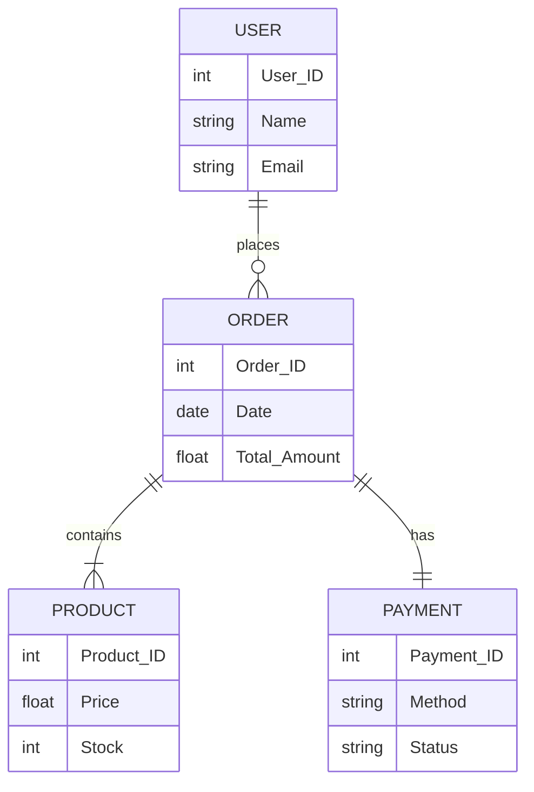

# Topic 29: Data-Oriented Design (Warnier-Orr and ER Modeling)

[< Prev: Process-Oriented Design](topic-28.md) | [Index](index.md) | [Next: Object-Oriented Design (Booch) >](topic-30.md)

---

> Data-oriented design focuses on the **organization and structure of data** instead of processes. The main idea is that **data is the most stable part** of a system. Processes may change frequently, but data structure usually remains stable.

---

## 1. What is Data-Oriented Design?

Developers first determine:
- What data the system will **store**
- How data elements are **related**
- How data structures should be **organized**

> After defining data structure, processes are designed to **manipulate** that data.

---

## 2. Simple Real-Life Example: Library Management

| Data Entity | Attributes |
|---|---|
| Book | Title, Author, ISBN, Availability |
| Student | Name, ID, Department |
| Borrow Record | Book ID, Student ID, Date |

> Once data structures exist, the system can perform operations like search, issue, and return.

---

## 3. Software Example: E-commerce Platform



> After defining these structures, processes like placing orders or processing payments are designed.

---

## 4. Warnier-Orr Diagram

Represents **hierarchical relationships** in data structures. Describes how complex data is composed of smaller parts.

### Example: University Record

```
University Record
    +-- Department
    |       +-- Students
    |       +-- Courses
    +-- Student Record
            +-- Name
            +-- Roll Number
            +-- Course List
```

> Particularly useful when designing **structured files or complex data formats**.

---

## 5. Entity-Relationship (ER) Modeling

One of the most widely used techniques for **database design**.

| Concept | Description | Example |
|---|---|---|
| **Entity** | Object to store data about | Student, Course |
| **Attribute** | Property of an entity | Student_ID, Name |
| **Relationship** | How entities interact | Student enrolls in Course |

---

## 6. Advantages of Data-Oriented Design

| Advantage |
|---|
| Well-organized and consistent data structures |
| Reduced data duplication |
| Simplified database design |
| Improved data integrity |

---

## 7. Real Industry Example: Banking Systems

| Entity | Purpose |
|---|---|
| Customer | Stores customer information |
| Account | Stores account details |
| Transaction | Records all transactions |

> Once these structures are defined properly, operations like deposits, withdrawals, and transfers can be implemented **reliably**.

> Poor data design in such systems could cause **major financial errors**.

---

## 8. Key Insight

> Data-oriented design emphasizes that **well-structured data is the foundation** of reliable software systems.

Many modern systems combine both approaches:
- **Process-oriented design** to model operations
- **Data-oriented design** to structure information

> Together they create a **balanced system architecture**.

---

[< Prev: Process-Oriented Design](topic-28.md) | [Index](index.md) | [Next: Object-Oriented Design (Booch) >](topic-30.md)