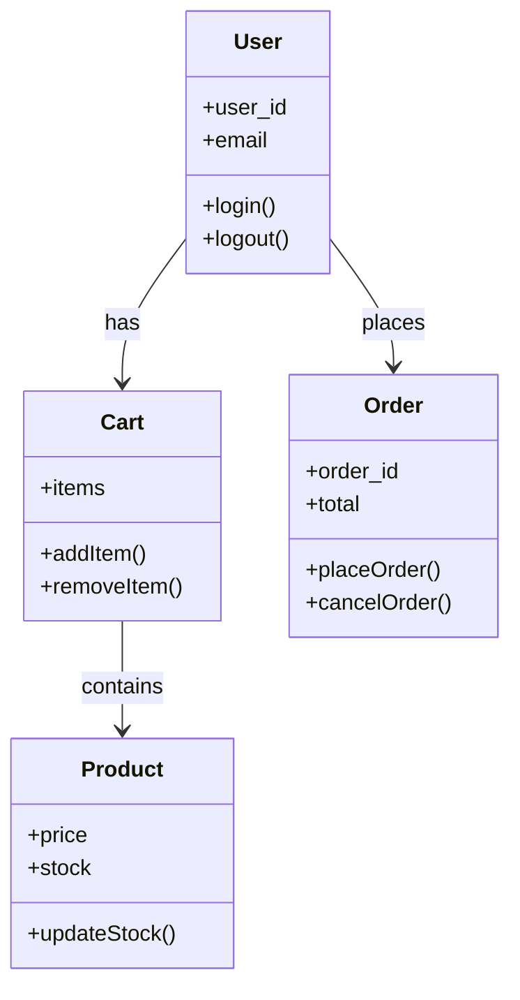
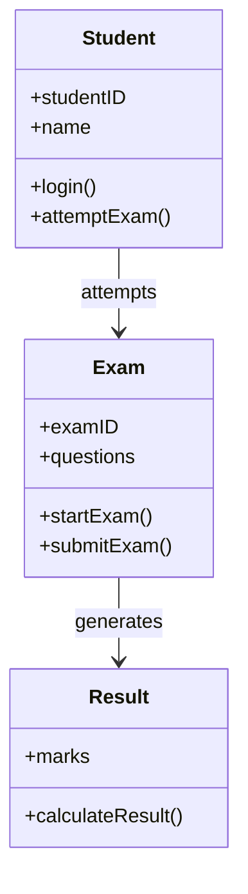

# Topic 30: Object-Oriented Design (Booch Approach)

[< Prev: Data-Oriented Design](topic-29.md) | [Index](index.md) | [Next: Cohesion and Coupling >](topic-31.md)

---

> Modern software systems are usually built using **object-oriented design (OOD)**. One of the early and influential OOD methodologies was proposed by **Grady Booch**, known as the **Booch Method**.

---

## 1. What is Object-Oriented Design?

A design method where a system is modeled using **objects, classes, and interactions**.

Each object contains:
- **Attributes** (data/state)
- **Methods** (behavior/functions)

> Instead of focusing on procedures, this design focuses on **entities and their responsibilities**.

---

## 2. Simple Real-Life Example: Library System

| Object | Attributes | Behavior |
|---|---|---|
| **Book** | Title, Author, ISBN, Availability | checkAvailability() |
| **Member** | Name, Membership ID, Borrowed books | borrowBook(), returnBook() |
| **Librarian** | Name, Employee ID | issueBook(), acceptReturn() |

> These objects **interact** with each other to perform system operations.

---

## 3. Software Example: E-commerce Platform

---

## 4. Booch Method

Focuses on identifying:
- **Classes** and **Objects**
- **Relationships** between them
- **Interactions** between objects

> The Booch method introduced diagrams that later influenced **UML (Unified Modeling Language)**.

---

## 5. Booch Diagrams

| Category | Description | Examples |
|---|---|---|
| **Static Diagrams** | Describe system structure | Class diagrams, Object diagrams, Module diagrams |
| **Dynamic Diagrams** | Describe system behavior over time | Interaction diagrams, State transition diagrams |

---

## 6. Example: Online Exam System (Booch Design)

> Student attempts Exam, system evaluates, Result generated. Design clearly **separates responsibilities**.

---

## 7. Advantages of Object-Oriented Design

| Advantage | Description |
|---|---|
| **Modularity** | Each object handles its own responsibilities |
| **Reusability** | Classes can be reused in other systems |
| **Maintainability** | Changes in one class don't affect entire system |
| **Real-world mapping** | Systems easier to understand |

---

## 8. Real Industry Example

Most modern applications use OOD:

| Platform | Technology |
|---|---|
| Java backend systems | Spring Boot |
| Python web applications | Django |
| PHP applications | Laravel |
| Android applications | Java/Kotlin |

---

## 9. Important Insight

> Object-oriented design aligns closely with **real-world modeling**. This makes it easier to build complex systems while maintaining **structure and flexibility**.

> Because of these advantages, OOD has become the **dominant approach** in modern software engineering.

---

[< Prev: Data-Oriented Design](topic-29.md) | [Index](index.md) | [Next: Cohesion and Coupling >](topic-31.md)