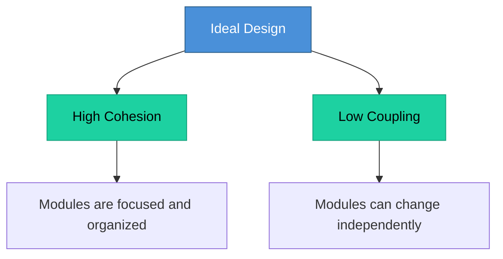

# Topic 31: Cohesion and Coupling

[< Prev: Object-Oriented Design (Booch)](topic-30.md) | [Index](index.md) | [Next: Design Matrices >](topic-32.md)

---

> When designing software systems, two important concepts help achieve good module organization: **cohesion** and **coupling**. They measure how well modules are designed and how they interact.

---

## 1. What is a Module?

A **self-contained** part of a system that performs a specific task.

| Example Modules |
|---|
| Authentication module |
| Payment processing module |
| Order management module |
| Notification service |

---

## 2. What is Cohesion?

Cohesion refers to how **closely related** the functions inside a module are.

> **High cohesion** = all components work together for a single well-defined task.

### Good Design (High Cohesion)

```
Authentication Module:
    login()
    logout()
    resetPassword()
    validateToken()
```

> All functions are related to authentication.

### Poor Design (Low Cohesion)

```
Authentication Module:
    login()
    calculateSalary()
    sendEmail()
    generateReport()
```

> These functions are **unrelated**.

---

## 3. Types of Cohesion (Worst to Best)

| Type | Description | Quality |
|---|---|---|
| **Coincidental** | Unrelated tasks placed together | Worst |
| **Logical** | Tasks of similar type grouped | Poor |
| **Temporal** | Tasks executed at the same time | Below Average |
| **Procedural** | Tasks following a specific sequence | Average |
| **Communicational** | Tasks operating on the same data | Above Average |
| **Sequential** | Output of one function becomes input to another | Good |
| **Functional** | All elements contribute to one specific task | Best |

---

## 4. What is Coupling?

Coupling refers to how **strongly** different modules depend on each other.

> **Low coupling** = modules interact with minimal dependency. (Desirable)

### Tightly Coupled Example

```
Order module directly modifies payment module database tables.
If payment structure changes --> Order module breaks.
```

### Loosely Coupled Example

```
Order module calls payment service API.
If payment system changes internally --> Order module still works.
```

---

## 5. Types of Coupling (Worst to Best)

| Type | Description | Quality |
|---|---|---|
| **Content** | One module directly modifies another's internal data | Worst |
| **Common** | Multiple modules share global data | Poor |
| **Control** | One module controls another's behavior | Average |
| **Stamp** | Modules share complex data structures | Above Average |
| **Data** | Modules communicate using simple data parameters | Best |

**Example of data coupling (best):**

```
paymentService.processPayment(orderId, amount)
```

---

## 6. Ideal Software Design



---

## 7. Real Industry Example: Microservices Architecture

| Principle | Implementation |
|---|---|
| **High cohesion** | One service handles one responsibility |
| **Low coupling** | Services communicate through APIs |

> This allows systems to **scale and evolve** easily.

---

## 8. Key Insight

> Many software maintenance problems occur when modules are **tightly coupled** or **poorly cohesive**.

> Designing with **high cohesion and low coupling** leads to better scalability, maintainability, and reliability.

---

[< Prev: Object-Oriented Design (Booch)](topic-30.md) | [Index](index.md) | [Next: Design Matrices >](topic-32.md)