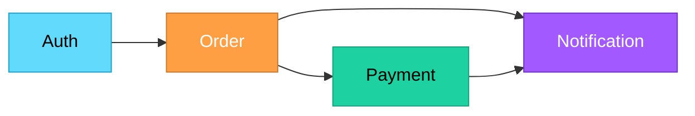

# Topic 32: Design Matrices

[< Prev: Cohesion and Coupling](topic-31.md) | [Index](index.md) | [Next: Design Documentation Standards >](topic-33.md)

---

> During system design, engineers often need a structured way to represent **relationships between components**. A design matrix helps visualize how modules interact and analyze dependencies.

---

## 1. What is a Design Matrix?

A **table** that represents relationships between system components such as modules, functions, or data elements.

- Rows and columns represent system components
- Table entries indicate how these components **interact**
- Helps designers analyze **coupling and dependencies**

---

## 2. Purpose of Design Matrices

| Purpose |
|---|
| Identify dependencies between modules |
| Detect unnecessary complexity |
| Improve system modularity |
| Reduce coupling between components |
| Organize system architecture clearly |

---

## 3. Software Example

### System Modules

| Module | Auth | Order | Payment | Notification |
|---|---|---|---|---|
| **Auth** | -- | Depends | -- | -- |
| **Order** | -- | -- | Depends | Depends |
| **Payment** | -- | -- | -- | Depends |
| **Notification** | -- | -- | -- | -- |

**Reading the matrix:**
- Auth module depends on Order (user validation)
- Order module depends on Payment and Notification
- Payment module depends on Notification (send confirmation)

---

## 4. Advantages of Design Matrices

| Advantage |
|---|
| Detect unnecessary module dependencies |
| Encourage low coupling |
| Make system relationships easy to visualize |
| Help organize architecture before implementation |

---

## 5. Real Software Engineering Example

### Banking System Modules

| Module |
|---|
| Customer management |
| Account management |
| Transaction processing |
| Fraud detection |
| Reporting |

> A design matrix ensures each module communicates **only with the modules it actually needs**.

---

## 6. Important Insight

> If a design matrix shows that **every module depends on every other module**, the system is **poorly designed**.

> A well-designed system should show **limited and well-defined interactions** between modules. This supports the principle of **low coupling and high cohesion**.

---

[< Prev: Cohesion and Coupling](topic-31.md) | [Index](index.md) | [Next: Design Documentation Standards >](topic-33.md)