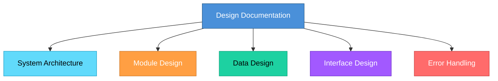

# Topic 33: Design Documentation Standards

[< Prev: Design Matrices](topic-32.md) | [Index](index.md) | [Next: CASE Tools - Concept >](topic-34.md)

---

> Once system design is completed, the design must be **documented properly** so that developers, testers, and future maintainers understand how the system is structured.

---

## 1. What is Design Documentation?

A detailed description of **how the system will be implemented**. It acts as a **blueprint** for developers during implementation.

It explains:
- System architecture
- Module structure
- Data structures
- Algorithms
- Interfaces between modules

---

## 2. Why Design Documentation Is Important

| Without Documentation | With Documentation |
|---|---|
| Modules implemented inconsistently | Everyone follows same architecture |
| Integration problems occur | Smooth integration |
| Future maintenance difficult | Design decisions preserved |

---

## 3. Key Elements of Design Documentation

### System Architecture

Describes overall structure: Layered, Client-server, or Microservices architecture.

### Module Design

For each module:

| Element | Example |
|---|---|
| Purpose | Process user payments |
| Input | Order ID, payment method |
| Output | Payment confirmation |
| Dependencies | Order service, Payment gateway |

### Data Design

| Table | Columns |
|---|---|
| Order | Order_ID, User_ID, Product_ID, Total_Amount |
| User | User_ID, Name, Email |

### Interface Design

How modules interact:
- API specifications
- Data exchange formats
- Communication protocols

### Error Handling

| Error Type | Handling |
|---|---|
| Invalid user input | Validation and error message |
| Payment failure | Retry mechanism and notification |
| Server errors | Graceful degradation |

---

## 4. Design Documentation Standards

| Standard | Description |
|---|---|
| Clear and structured format | Organized sections |
| Consistent terminology | Same terms throughout |
| Detailed diagrams | Architecture, class, sequence, DFD |
| Version control | Track document changes |

---

## 5. Real Software Example: Banking Application

Design documentation might include:

| Section | Content |
|---|---|
| Architecture | Microservices for accounts, transactions, authentication |
| Database design | Tables for customers, accounts, transactions |
| API documentation | How mobile apps communicate with backend |

> Without such documentation, developers would **struggle to coordinate** their work.

---

## 6. Importance for Future Maintenance

Future developers may not be familiar with original design. Documentation helps them understand:
- **Why** certain design decisions were made
- **How** modules interact
- **Where** modifications can be made safely

---

## 7. Key Insight

> Good design documentation ensures that the system architecture is **preserved** throughout development and maintenance. It acts as a **long-term reference** that keeps the system understandable even as teams change.

---

[< Prev: Design Matrices](topic-32.md) | [Index](index.md) | [Next: CASE Tools - Concept >](topic-34.md)