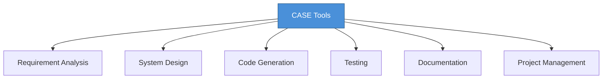

# Topic 34: CASE Tools - Concept

[< Prev: Design Documentation Standards](topic-33.md) | [Index](index.md) | [Next: Relevance of CASE Tools >](topic-35.md)

---

> As software systems became larger and more complex, manually managing analysis, design, coding, and documentation became difficult. **CASE (Computer-Aided Software Engineering)** tools were created to assist developers.

---

## 1. What are CASE Tools?

Software tools that help **automate or support** tasks in software development.

> Main purpose: **increase productivity, improve quality, reduce development time**.

---

## 2. Why CASE Tools Are Needed

| Manual Approach | With CASE Tools |
|---|---|
| Human errors | Automated validation |
| Inconsistent documentation | Auto-generated docs |
| Slow development | Faster workflows |
| Difficult maintenance | Structured management |

---

## 3. Activities Supported by CASE Tools

| Activity | CASE Tool Support | Example |
|---|---|---|
| Requirement Analysis | Document and organize requirements | Requirement management tools |
| System Design | Create UML, DFD, ER diagrams | Visual modeling tools |
| Coding | Generate code from designs | Code generation tools |
| Testing | Automate test execution | Automated test frameworks |
| Project Management | Track schedules, tasks, resources | Project tracking software |

---

## 4. Benefits of CASE Tools

| Benefit |
|---|
| Increase development productivity |
| Improve software quality |
| Reduce manual errors |
| Maintain consistent documentation |
| Simplify team collaboration |

---

## 5. Limitations of CASE Tools

| Limitation |
|---|
| Can be expensive |
| Learning curve requires training |
| Some tools may not integrate well |

---

## 6. Real Industry Examples

| Category | Modern Examples |
|---|---|
| UML modeling | StarUML, Lucidchart |
| Automated testing | Selenium, JUnit |
| CI/CD | Jenkins, GitHub Actions |
| Documentation | Swagger, JSDoc |

---

## 7. Key Insight

> CASE tools **do not replace** software engineers. Instead, they assist engineers by **automating repetitive tasks** and providing structured ways to design and manage software systems.

---

[< Prev: Design Documentation Standards](topic-33.md) | [Index](index.md) | [Next: Relevance of CASE Tools >](topic-35.md)