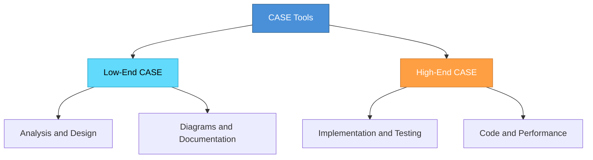

# Topic 36: High-End and Low-End CASE Tools

[< Prev: Relevance of CASE Tools](topic-35.md) | [Index](index.md) | [Next: Choice of Programming Languages >](topic-37.md)

---

> CASE tools are categorized based on the **phase of development** they support: **Low-End** (early stages) and **High-End** (later stages).

---

## 1. Low-End CASE Tools

Support the **early stages**: system analysis and design.

| Activities Supported |
|---|
| Requirement analysis |
| System modeling |
| Diagram creation |
| Documentation |
| Database design |

### Examples

| Tool | Purpose |
|---|---|
| Lucidchart | Diagram creation |
| Draw.io | Visual modeling |
| ER modeling tools | Database design |
| UML design tools | System modeling |

---

## 2. High-End CASE Tools

Support the **later stages**: implementation, testing, and maintenance.

| Activities Supported |
|---|
| Code generation |
| Program debugging |
| Software testing |
| Performance analysis |
| System maintenance |

### Examples

| Tool | Purpose |
|---|---|
| Automated testing frameworks | Test execution |
| Static code analysis tools | Error detection |
| CI/CD systems | Automated builds |
| Performance monitoring tools | System analysis |

---

## 3. Comparison

| Aspect | Low-End CASE | High-End CASE |
|---|---|---|
| **Phase** | Analysis and Design | Implementation and Testing |
| **Focus** | Diagrams and documentation | Code and performance |
| **Output** | System models | Working software |

---

## 4. Real Example: E-commerce Platform

| Phase | Tools Used |
|---|---|
| Design database schema | Low-End CASE |
| Create UML diagrams | Low-End CASE |
| Generate code | High-End CASE |
| Automated testing | High-End CASE |
| Monitor performance | High-End CASE |

> Together they improve productivity and maintain quality.

---

## 5. Key Insight

> Low-End tools assist in **planning and design**, while High-End tools assist in **implementation and maintenance**. Using both effectively helps manage complex projects.

---

[< Prev: Relevance of CASE Tools](topic-35.md) | [Index](index.md) | [Next: Choice of Programming Languages >](topic-37.md)