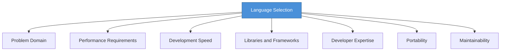

# Topic 37: Choice of Programming Languages

[< Prev: High-End and Low-End CASE Tools](topic-36.md) | [Index](index.md) | [Next: Mixed Language Programming >](topic-38.md)

---

> Selecting an appropriate programming language is an important **design decision**. The language chosen affects system performance, development speed, maintainability, and scalability.

---

## 1. Factors Affecting Language Selection

| Factor | Description | Example |
|---|---|---|
| **Problem Domain** | Type of problem being solved | Python for ML, JavaScript for web |
| **Performance** | Need for speed and low latency | C/C++ for OS, embedded systems |
| **Development Speed** | How quickly code can be written | Python requires fewer lines |
| **Libraries/Frameworks** | Available ecosystem | React for web, TensorFlow for ML |
| **Developer Expertise** | Team skills and experience | Use what team knows best |
| **Portability** | Cross-platform support | Java runs on JVM across platforms |
| **Maintainability** | Long-term code clarity | Clear syntax, strong community |

---

## 2. Multi-Language Systems

Modern systems often use **multiple languages** together:

| Component | Language |
|---|---|
| User Interface | HTML, CSS |
| Client-side logic | JavaScript |
| Backend services | Python, Java |
| Database | SQL |

> Using the **best tool for each task**.

---

## 3. Consequences of Wrong Choice

| Problem |
|---|
| Poor performance |
| Difficult maintenance |
| Longer development time |
| Limited scalability |

---

## 4. Key Insight

> A programming language is a **tool for solving problems**. The best language depends on the specific requirements and the expertise of the development team.

---

[< Prev: High-End and Low-End CASE Tools](topic-36.md) | [Index](index.md) | [Next: Mixed Language Programming >](topic-38.md)