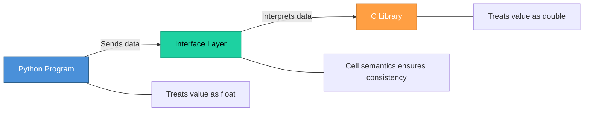

# Topic 38: Mixed Language Programming and Cell Semantics

[< Prev: Choice of Programming Languages](topic-37.md) | [Index](index.md) | [Next: Re-engineering Legacy Systems >](topic-39.md)

---

> Modern software systems are rarely built using only one language. **Mixed language programming** combines multiple languages to leverage their strengths. **Cell semantics** defines how memory data is interpreted when shared between languages.

---

## 1. Mixed Language Programming

Using **multiple programming languages** within the same software system, each for the tasks it performs best.

### Example: Modern Web Application

| Language | Role |
|---|---|
| HTML/CSS | Interface layout |
| JavaScript | Client-side interaction |
| Python/Java | Backend logic |
| SQL | Database operations |

### Example: Machine Learning Systems

| Language | Role |
|---|---|
| Python | High-level programming |
| C/C++ | Performance-critical computation |

---

## 2. Advantages

| Advantage |
|---|
| Use best language for each task |
| Improve performance for critical operations |
| Integrate with existing systems in different languages |
| Greater flexibility in development |

---

## 3. Challenges

| Challenge |
|---|
| Managing communication between languages |
| Memory management complexity |
| Debugging across different languages |

> Proper design and **clear interfaces** are necessary.

---

## 4. Cell Semantics

How data stored in **memory cells** is interpreted when shared between different programming languages.

Both languages must agree on:
- **Data types**
- **Memory layout**
- **Parameter passing methods**

> Without proper rules, **data corruption** or unexpected behavior may occur.

---

## 5. Key Insight

> Mixed language programming allows developers to **combine strengths** of different languages, while cell semantics ensures that **shared data is handled consistently** across those languages.

---

[< Prev: Choice of Programming Languages](topic-37.md) | [Index](index.md) | [Next: Re-engineering Legacy Systems >](topic-39.md)