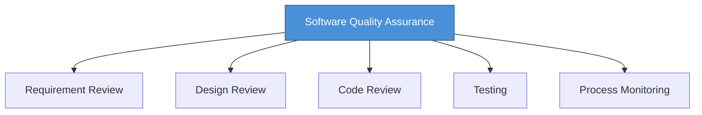

# Topic 41: Software Quality Assurance (SQA)

[< Prev: Coding Standards](topic-40.md) | [Index](index.md) | [Next: White Box and Black Box Testing >](topic-42.md)

---

> After coding, ensuring software works correctly, reliably, and efficiently is critical. **SQA** focuses on maintaining and improving quality during development -- not just testing after the fact.

---

## 1. What is SQA?

A set of activities designed to ensure that software processes and products meet **specified requirements and quality standards**.

> SQA focuses on **preventing defects** rather than only detecting them.

---

## 2. QA vs Testing

| Aspect | Quality Assurance | Testing |
|---|---|---|
| **Focus** | Improve development process | Find defects in product |
| **When** | Throughout development | After coding |
| **Goal** | Prevent defects | Detect defects |

---

## 3. Activities in SQA

| Activity | Purpose |
|---|---|
| **Requirement Review** | Ensure requirements are clear and complete |
| **Design Review** | Verify design meets requirements and best practices |
| **Code Review** | Detect problems, ensure coding standards |
| **Testing** | Verify software behaves correctly |
| **Process Monitoring** | Ensure teams follow established procedures |

---

## 4. Benefits of SQA

| Benefit |
|---|
| Reduces number of defects |
| Improves system reliability |
| Reduces maintenance costs |
| Increases user satisfaction |
| Delivers high-quality products |

---

## 5. Key Insight

> Fixing errors after deployment is **much more expensive** than preventing them during development. SQA improves development processes to reduce defects and ensure high-quality systems.

---

[< Prev: Coding Standards](topic-40.md) | [Index](index.md) | [Next: White Box and Black Box Testing >](topic-42.md)