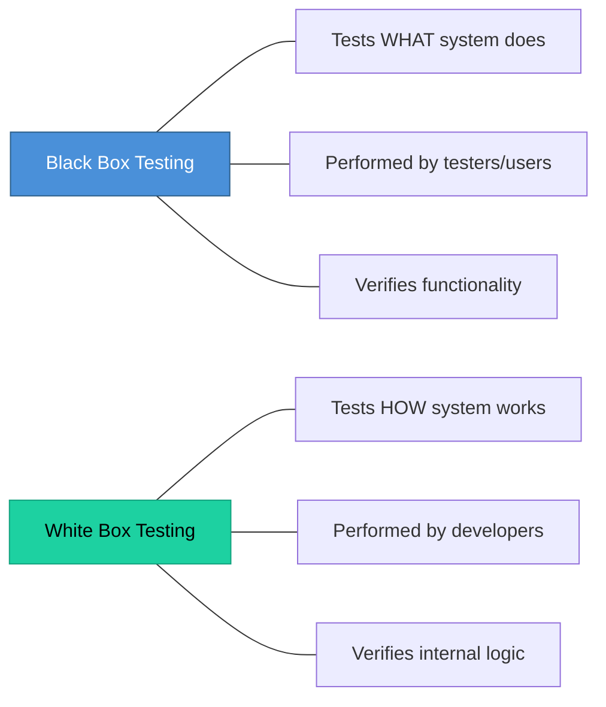

# Topic 42: White Box Testing and Black Box Testing

[< Prev: Software Quality Assurance](topic-41.md) | [Index](index.md) | [Next: Unit and Integration Testing >](topic-43.md)

---

> Two fundamental testing approaches: **Black Box Testing** (tests functionality without knowing internal code) and **White Box Testing** (tests internal logic and code paths).

---

## 1. Black Box Testing

Tests the **behavior** of the system without knowing internal implementation.

> The tester treats software as a "black box": inputs are given, outputs are checked.

### Example: Login Page

| Input | Expected Output |
|---|---|
| Correct username and password | User logged in |
| Incorrect password | Access denied |
| Empty fields | Error message |

### Techniques

| Technique | Description |
|---|---|
| **Equivalence Partitioning** | Divide input into valid and invalid groups |
| **Boundary Value Analysis** | Test edge values (min, max) |
| **Decision Table Testing** | Test different input combinations |

### Advantages and Limitations

| Advantages | Limitations |
|---|---|
| No programming knowledge required | May miss internal logic errors |
| Tests from user perspective | Cannot verify code coverage |
| Detects missing features | |

---

## 2. White Box Testing

Tests the **internal structure and logic** of the program. Tester knows the code.

### Example: Discount Calculation

```python
if purchase_amount > 1000:
    discount = 10  # percent
else:
    discount = 5   # percent
```

| Test Case | Expected Result |
|---|---|
| purchase_amount = 1200 | 10% discount |
| purchase_amount = 800 | 5% discount |

> Ensures **every possible path** in code is executed.

### Techniques

| Technique | Description |
|---|---|
| **Statement Coverage** | Every statement runs at least once |
| **Branch Coverage** | Every decision branch is tested |
| **Path Coverage** | All possible execution paths tested |

### Advantages and Limitations

| Advantages | Limitations |
|---|---|
| Detects hidden logical errors | Requires programming knowledge |
| Ensures thorough code coverage | Can be time-consuming |
| Improves code quality | |

---

## 3. Comparison



| Aspect | Black Box | White Box |
|---|---|---|
| **Focus** | What system does | How system works |
| **Tester** | Users/testers | Developers |
| **Knowledge** | No code access | Full code access |
| **Verifies** | Functionality | Internal logic |

---

## 4. Key Insight

> Effective testing usually **combines both approaches**. Black box testing ensures correct behavior from user perspective, while white box testing ensures reliable internal logic.

---

[< Prev: Software Quality Assurance](topic-41.md) | [Index](index.md) | [Next: Unit and Integration Testing >](topic-43.md)