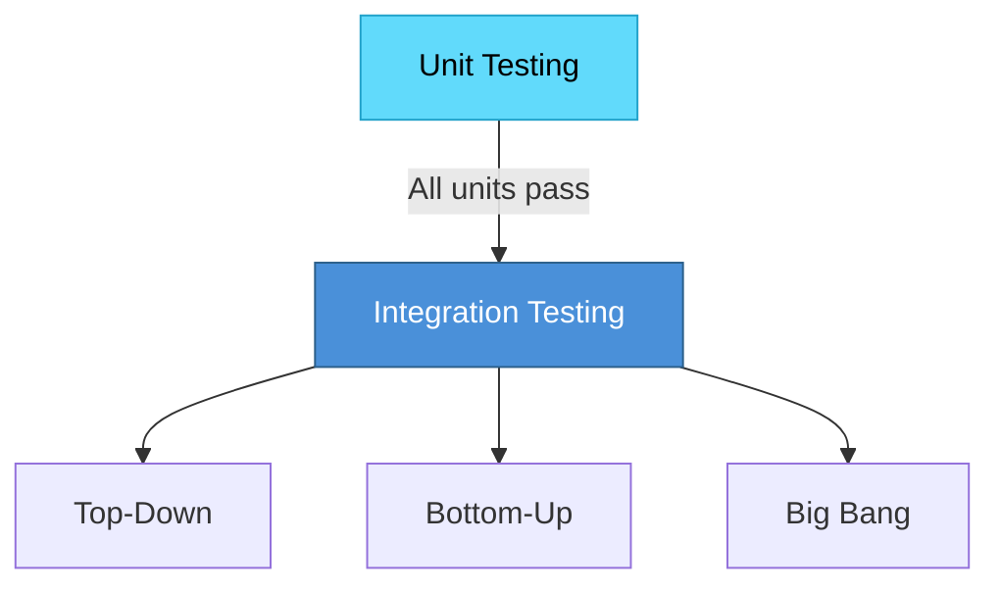

# Topic 43: Unit Testing and Integration Testing

[< Prev: White Box and Black Box Testing](topic-42.md) | [Index](index.md) | [Next: Verification and Validation >](topic-44.md)

---

> Testing is performed at multiple levels. **Unit Testing** verifies individual components, while **Integration Testing** verifies that components work together correctly.

---

## 1. Unit Testing

Testing the **smallest individual components** (function, method, class, module) in isolation.

### Example

```python
def calculate_total(price, tax):
    return price + (price * tax)

# Test cases
assert calculate_total(100, 0.1) == 110
assert calculate_total(200, 0.05) == 210
```

### Characteristics

| Aspect | Description |
|---|---|
| Focus | Small pieces of code |
| Performed by | Developers |
| When | During coding, before integration |
| Tools | JUnit (Java), PyTest (Python), NUnit (.NET) |

### Advantages

| Advantage |
|---|
| Detects bugs early |
| Simplifies debugging |
| Improves code reliability |
| Encourages modular programming |

---

## 2. Integration Testing

After units are tested individually, they are **combined** and tested together.



### Types of Integration Testing

| Type | Description | Direction |
|---|---|---|
| **Top-Down** | Start from higher-level modules | UI --> Logic --> Database |
| **Bottom-Up** | Start from lower-level modules | Database --> Logic --> UI |
| **Big Bang** | All modules integrated at once | Simple but hard to debug |

---

## 3. Comparison

| Aspect | Unit Testing | Integration Testing |
|---|---|---|
| **Focus** | Individual components | Interaction between components |
| **When** | During coding | After multiple modules developed |
| **Finds** | Internal module errors | Communication errors |

---

## 4. Key Insight

> Unit testing ensures each component works properly. Integration testing ensures all components **cooperate correctly**. Together they form an essential foundation for reliable testing.

---

[< Prev: White Box and Black Box Testing](topic-42.md) | [Index](index.md) | [Next: Verification and Validation >](topic-44.md)