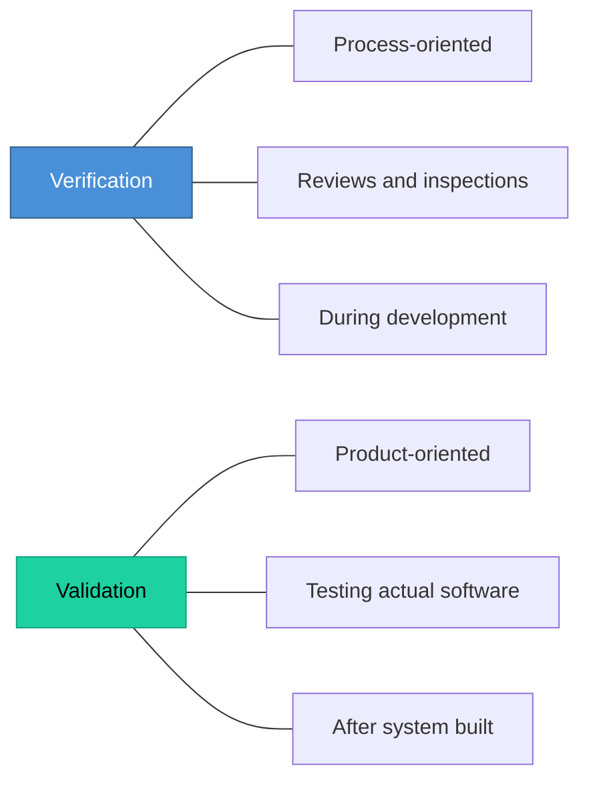

# Topic 44: Verification and Validation of Software

[< Prev: Unit and Integration Testing](topic-43.md) | [Index](index.md) | [Next: Debugging and Reliability Analysis >](topic-45.md)

---

> **Verification:** "Are we building the product **right**?" (Matches specifications)
>
> **Validation:** "Are we building the **right** product?" (Meets user needs)

---

## 1. Verification

Checks whether software is built **according to specifications and design**.

| Activity | Description |
|---|---|
| Requirement reviews | Examine requirements for clarity |
| Design reviews | Verify design meets requirements |
| Code inspections | Analyze code for correctness |
| Walkthroughs | Step through logic without execution |

> These analyze documents and code **without executing** the program.

---

## 2. Validation

Checks whether the final product **satisfies user needs** and expectations.

| Activity | Description |
|---|---|
| System testing | Full system behavior testing |
| User acceptance testing | Users verify requirements met |
| Beta testing | Real users test in real conditions |

> These involve **running the software** to ensure correct performance.

---

## 3. Comparison

| Aspect | Verification | Validation |
|---|---|---|
| **Focus** | Development process | Final product |
| **Method** | Reviews and inspections | Testing |
| **When** | During development | After completion |
| **Question** | Built correctly? | Right product? |

---

## 4. Key Insight

> A successful system requires **both**. Verification ensures correct implementation. Validation ensures user satisfaction.

---

[< Prev: Unit and Integration Testing](topic-43.md) | [Index](index.md) | [Next: Debugging and Reliability Analysis >](topic-45.md)