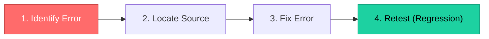

# Topic 45: Debugging and Software Reliability Analysis

[< Prev: Verification and Validation](topic-44.md) | [Index](index.md) | [Next: Software Metrics >](topic-46.md)

---

> **Debugging** locates and fixes errors found during testing. **Reliability analysis** measures how dependably the software performs over time.

---

## 1. Debugging

The process of identifying, locating, and **fixing errors** (bugs) after testing detects them.

### Steps in Debugging

| Step | Description |
|---|---|
| Identify | Observe incorrect behavior |
| Locate | Examine code logic, variable values, execution flow |
| Fix | Modify code to correct the problem |
| Retest | Run tests again to verify fix and check for new errors |

---

## 2. Software Reliability

The probability that software operates **without failure** for a specified period under specified conditions.

### Key Metrics

| Metric | Description | Formula |
|---|---|---|
| **MTTF** (Mean Time to Failure) | Average time before failure | -- |
| **MTTR** (Mean Time to Repair) | Average time to fix failure | -- |
| **MTBF** (Mean Time Between Failures) | Average time between consecutive failures | MTBF = MTTF + MTTR |

> Higher MTBF = **higher reliability**.

---

## 3. Improving Reliability

| Method |
|---|
| Writing well-structured code |
| Performing thorough testing |
| Using error-handling mechanisms |
| Monitoring system performance |
| Regular updates and maintenance |

---

## 4. Key Insight

> Debugging **removes** errors. Reliability analysis **measures** how consistently the system performs. Together they deliver stable software systems.

---

[< Prev: Verification and Validation](topic-44.md) | [Index](index.md) | [Next: Software Metrics >](topic-46.md)