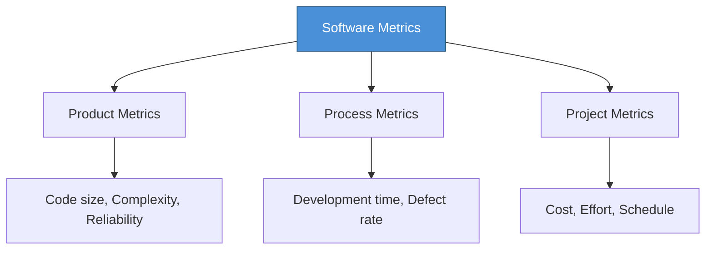

# Topic 46: Software Metrics

[< Prev: Debugging and Reliability Analysis](topic-45.md) | [Index](index.md) | [Next: Software Maturity Model (CMM) >](topic-47.md)

---

> **Software metrics** are numerical measures used to evaluate quality, complexity, productivity, and performance of software systems.

---

## 1. Types of Software Metrics

| Type | Focus | Examples |
|---|---|---|
| **Product Metrics** | Software product characteristics | Code size, complexity, reliability |
| **Process Metrics** | Development process effectiveness | Development time, defect detection rate |
| **Project Metrics** | Management aspects | Project cost, effort, schedule progress |

---

## 2. Common Software Metrics

| Metric | Description | Note |
|---|---|---|
| **Lines of Code (LOC)** | Program size by line count | Simple but doesn't reflect quality |
| **Cyclomatic Complexity** | Number of independent execution paths | Higher = harder to test |
| **Defect Density** | Bugs per thousand lines of code | Lower = higher quality |
| **Code Coverage** | Percentage of code executed during testing | Higher = more confidence |

---

## 3. Why Metrics Matter

| Purpose |
|---|
| Monitor development progress |
| Estimate project cost and time |
| Identify problem areas |
| Measure productivity |
| Support better project management |

---

## 4. Key Insight

> Software metrics provide **objective data** for evaluating systems and processes. By measuring size, complexity, and defects, they support better decision-making and **continuous improvement**.

---

[< Prev: Debugging and Reliability Analysis](topic-45.md) | [Index](index.md) | [Next: Software Maturity Model (CMM) >](topic-47.md)