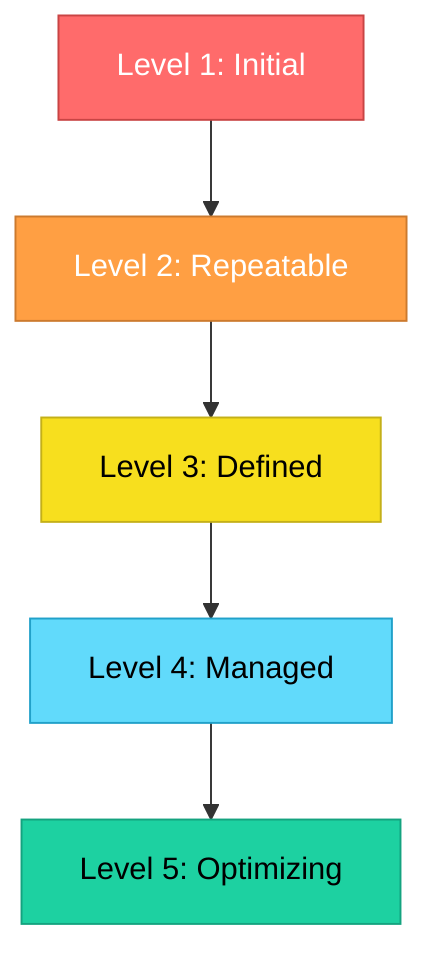

# Topic 47: Software Maturity Model (CMM and Extensions)

[< Prev: Software Metrics](topic-46.md) | [Index](index.md) | [Next: Function Point Analysis >](topic-48.md)

---

> The **Capability Maturity Model (CMM)** evaluates how mature and well-defined an organization's software development processes are. Developed by SEI at Carnegie Mellon University.

---

## 1. CMM Maturity Levels

| Level | Name | Description |
|---|---|---|
| **1** | Initial | Chaotic, unpredictable, depends on individual effort |
| **2** | Repeatable | Basic project management, successful practices can be repeated |
| **3** | Defined | Standardized processes documented across organization |
| **4** | Managed | Processes measured and controlled using quantitative metrics |
| **5** | Optimizing | Continuous process improvement and innovation |

---

## 2. Benefits of CMM

| Benefit |
|---|
| Improves software quality |
| Reduces development risks |
| Helps deliver projects on time |
| Encourages continuous improvement |

---

## 3. CMMI (Extension)

**CMMI (Capability Maturity Model Integration)** integrates different process improvement models into a single framework. Used in:
- Software development
- Systems engineering
- Product development

---

## 4. Key Insight

> As organizations move through maturity levels, their ability to manage **complex projects** and produce **high-quality software** improves significantly.

---

[< Prev: Software Metrics](topic-46.md) | [Index](index.md) | [Next: Function Point Analysis >](topic-48.md)