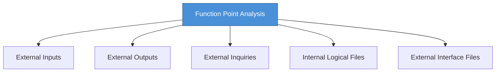

# Topic 48: Function Point Analysis (FPA)

[< Prev: Software Maturity Model (CMM)](topic-47.md) | [Index](index.md) | [Next: Cost Estimation Issues and Rayleigh Curve >](topic-49.md)

---

> Instead of measuring software by lines of code, **Function Point Analysis** measures the **functionality delivered to the user**. This makes estimation independent of programming language.

---

## 1. Five Functional Components



| Component | Description | Example |
|---|---|---|
| **External Inputs (EI)** | Data entering the system | Login credentials, order form |
| **External Outputs (EO)** | Data sent to users | Order confirmation, reports |
| **External Inquiries (EQ)** | Retrieval without modification | Product search, result check |
| **Internal Logical Files (ILF)** | Data maintained within system | Customer database table |
| **External Interface Files (EIF)** | Data from another system | Bank transaction database |

---

## 2. How Function Points are Calculated

Each component is assigned a **weight** based on complexity. The total function point value represents system size.

```
Total FP = Sum of (Count x Weight) for each component type
```

---

## 3. Advantages

| Advantage |
|---|
| Independent of programming language |
| Focuses on user functionality |
| Helps estimate time and cost |
| Can be used before coding begins |

---

## 4. Limitations

| Limitation |
|---|
| Requires experience to classify functions |
| May not capture highly technical complexity |
| Different analysts may produce different estimates |

---

## 5. Key Insight

> FPA provides a structured way to estimate software size based on **user functionality** rather than implementation details. Useful for project planning, cost estimation, and productivity measurement.

---

[< Prev: Software Maturity Model (CMM)](topic-47.md) | [Index](index.md) | [Next: Cost Estimation Issues and Rayleigh Curve >](topic-49.md)