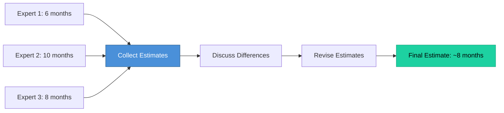

# Topic 51: Other Approaches to Cost and Size Estimation

[< Prev: Algorithmic Cost Models](topic-50.md) | [Index](index.md) | [Next: Planning Software Projects >](topic-52.md)

---

> Besides algorithmic models, several approaches rely on **expert judgment, experience, and project comparison** for estimation.

---

## 1. Estimation Based on Software Complexity

The more complex the system, the more effort, time, and cost required.

| Complexity Factor |
|---|
| Number of modules |
| Algorithm complexity |
| Component interactions |
| Data processing requirements |
| User interface complexity |

---

## 2. Delphi Method

Estimation based on **expert opinions** through iterative consensus.

| Step |
|---|
| Experts independently estimate effort |
| Estimates collected anonymously |
| Differences discussed |
| Experts revise estimates |
| Process repeats until convergence |

### Advantages

| Advantage |
|---|
| Uses expert experience |
| Reduces bias (anonymous estimates) |
| Useful when limited project data available |

---

## 3. Costing by Analogy

Estimates cost by **comparing with similar past projects**.

> If a previous online bookstore took 8 months, a similar movie streaming platform may take 7-9 months with adjustments for differences.

---

## 4. Comparison

| Method | Focus |
|---|---|
| Complexity estimation | Technical difficulty |
| Delphi method | Expert consensus |
| Costing by analogy | Comparison with past projects |

---

## 5. Key Insight

> Accurate estimation is difficult due to uncertainties. Using **multiple approaches** together allows more informed decisions about cost, time, and resources.

---

[< Prev: Algorithmic Cost Models](topic-50.md) | [Index](index.md) | [Next: Planning Software Projects >](topic-52.md)