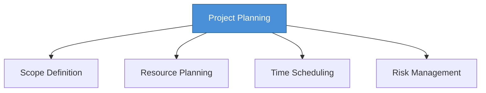

# Topic 52: Planning Software Projects

[< Prev: Other Estimation Approaches](topic-51.md) | [Index](index.md) | [Next: Work Breakdown Structure >](topic-53.md)

---

> Successful projects **begin with planning**, not coding. Planning defines scope, resources, schedule, and risk management strategies.

---

## 1. Planning Activities

### Scope Definition

Defines what features the system **will and will not** include.

### Resource Planning

| Resource Type | Example |
|---|---|
| Developers | 5 backend, 2 frontend |
| Testers | 2 QA engineers |
| Infrastructure | Servers, databases |
| Tools | IDEs, CI/CD systems |

### Time Scheduling

| Phase | Duration |
|---|---|
| Requirement analysis | 2 weeks |
| System design | 3 weeks |
| Implementation | 8 weeks |
| Testing | 4 weeks |

### Risk Management

| Common Risk | Mitigation |
|---|---|
| Requirement changes | Change management process |
| Technology issues | Prototyping early |
| Developer unavailability | Backup resources |
| Schedule delays | Buffer time in plan |

---

## 2. Benefits of Planning

| Benefit |
|---|
| Controls cost and schedule |
| Improves team coordination |
| Reduces development risks |
| Clearly defines project goals |

---

## 3. Key Insight

> Successful software projects do **not begin with coding**. They begin with clear planning that defines objectives, resources, timelines, and risks.

---

[< Prev: Other Estimation Approaches](topic-51.md) | [Index](index.md) | [Next: Work Breakdown Structure >](topic-53.md)