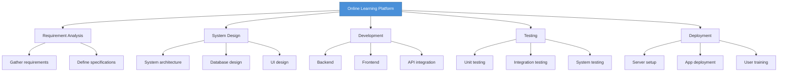

# Topic 53: Work Breakdown Structure (WBS)

[< Prev: Planning Software Projects](topic-52.md) | [Index](index.md) | [Next: Integrating Design and Planning >](topic-54.md)

---

> Large projects are divided into **smaller, manageable parts**. This structured decomposition is called a **Work Breakdown Structure (WBS)**.

---

## 1. WBS Hierarchy

```
Large Project --> Phases --> Tasks --> Subtasks
```



---

## 2. Purpose of WBS

| Purpose |
|---|
| Organize project tasks clearly |
| Estimate effort more accurately |
| Assign responsibilities to team members |
| Track progress and manage deadlines |
| Control project scope |

---

## 3. Benefits

| Benefit |
|---|
| Simplifies project management |
| Improves task assignment and accountability |
| Better cost and time estimation |
| Reduces risk of missing tasks |

---

## 4. Tools for WBS

| Tool |
|---|
| Jira |
| Microsoft Project |
| Asana |

---

## 5. Key Insight

> Complex projects become manageable when broken into **smaller, well-defined tasks**. WBS provides a systematic way to organize and control all aspects of a project.

---

[< Prev: Planning Software Projects](topic-52.md) | [Index](index.md) | [Next: Integrating Design and Planning >](topic-54.md)