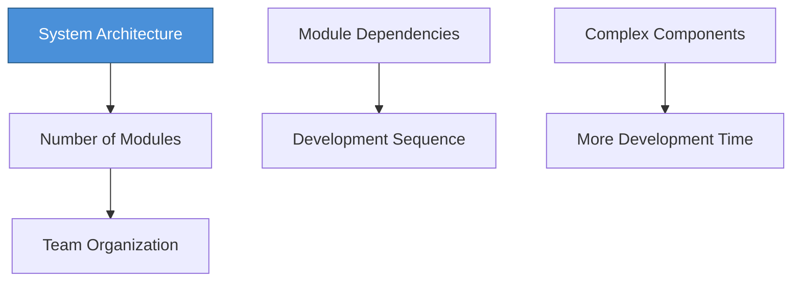

# Topic 54: Integrating Software Design and Project Planning

[< Prev: Work Breakdown Structure](topic-53.md) | [Index](index.md) | [Next: Software Project Teams >](topic-55.md)

---

> Design decisions directly affect schedule, cost, and resources. Effective project management requires **integrating design with planning**.

---

## 1. What Design Determines vs What Planning Determines

| Design | Planning |
|---|---|
| System architecture | Timeline |
| Modules and components | Team assignments |
| Interfaces and dependencies | Development stages |

---

## 2. Why Integration Matters

Without integration:

| Problem |
|---|
| Design may require more resources than planned |
| Schedule may not reflect architecture complexity |
| Module dependencies cause unexpected delays |

---

## 3. How Design Influences Planning

---

## 4. Real Industry Practice

| Methodology | Integration Approach |
|---|---|
| **Agile** | Design evolves with iterative planning |
| **DevOps** | Architecture, development, deployment closely aligned |
| **Traditional** | Architects and PMs collaborate in early planning |

---

## 5. Benefits

| Benefit |
|---|
| Better scheduling accuracy |
| Efficient resource allocation |
| Reduced integration risks |
| Improved team coordination |
| Higher on-time delivery rate |

---

## 6. Key Insight

> Architecture defines **how** the system is built. Planning defines **how** the work is executed. Integrating both ensures development aligns with technical realities.

---

[< Prev: Work Breakdown Structure](topic-53.md) | [Index](index.md) | [Next: Software Project Teams >](topic-55.md)