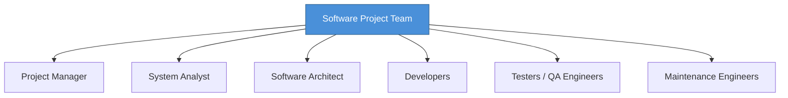

# Topic 55: Software Project Teams

[< Prev: Integrating Design and Planning](topic-54.md) | [Index](index.md) | [Next: Project Monitoring and Control >](topic-56.md)

---

> Most modern systems are built by **teams** with different skills and responsibilities. Effective team organization directly impacts project success.

---

## 1. Roles in a Software Project Team

| Role | Responsibility |
|---|---|
| **Project Manager** | Planning, scheduling, monitoring, stakeholder communication |
| **System Analyst** | Requirement analysis, system modeling, SRS preparation |
| **Software Architect** | System architecture, technology selection, module design |
| **Developers** | Feature implementation, coding, bug fixing |
| **Testers / QA** | Test cases, functional/performance testing, defect reporting |
| **Maintenance Engineers** | Post-release bug fixes, updates, performance improvements |

---

## 2. Team Structures

| Structure | Decision Making | Advantage | Disadvantage |
|---|---|---|---|
| **Democratic** | Shared among all members | Creativity, collaboration | Slower decisions |
| **Controlled Centralized** | Strong single leader | Fast decisions, clear leadership | Less flexibility |
| **Controlled Decentralized** | Distributed among team leads | Balanced, efficient | Needs coordination |

---

## 3. Key Insight

> Software development is a **collaborative effort**. A well-structured team combines different skills and roles to transform requirements into reliable systems.

---

[< Prev: Integrating Design and Planning](topic-54.md) | [Index](index.md) | [Next: Project Monitoring and Control >](topic-56.md)