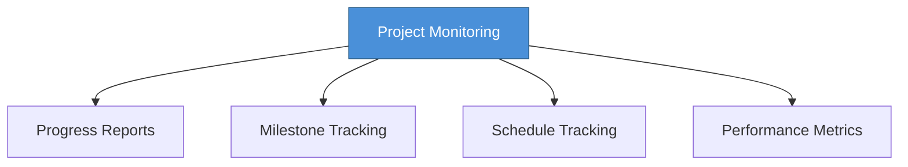

# Topic 56: Project Monitoring and Control

[< Prev: Software Project Teams](topic-55.md) | [Index](index.md)

---

> After development begins, managers must **continuously track progress** to ensure the project stays on schedule, within budget, and meets quality standards.

---

## 1. Monitoring vs Control

| Aspect | Monitoring | Control |
|---|---|---|
| **Purpose** | Track progress | Take corrective actions |
| **Activity** | Collect and analyze data | Adjust schedules, resources, scope |
| **Goal** | Detect problems early | Bring project back on track |

---

## 2. Monitoring Techniques

| Technique | Description |
|---|---|
| **Progress Reports** | Developers report completed tasks and problems |
| **Milestone Tracking** | Check if key phases completed on time |
| **Schedule Tracking** | Compare actual vs planned progress |
| **Performance Metrics** | Defect count, code completion rate, test coverage |

---

## 3. Control Actions

When monitoring detects problems:

| Action |
|---|
| Assign more developers |
| Simplify certain features |
| Adjust project schedule |
| Revise project scope |

---

## 4. Tools for Monitoring and Control

| Tool |
|---|
| Jira |
| Trello |
| Microsoft Project |
| Asana |

---

## 5. Key Insight

> Projects rarely proceed exactly as planned. **Monitoring** detects problems early, while **control** ensures corrective actions are taken. Together they help ensure successful project completion.

---

[< Prev: Software Project Teams](topic-55.md) | [Index](index.md)